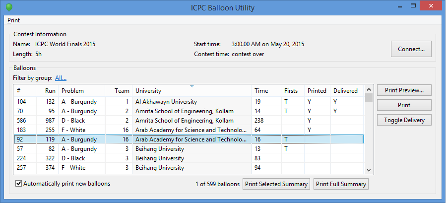
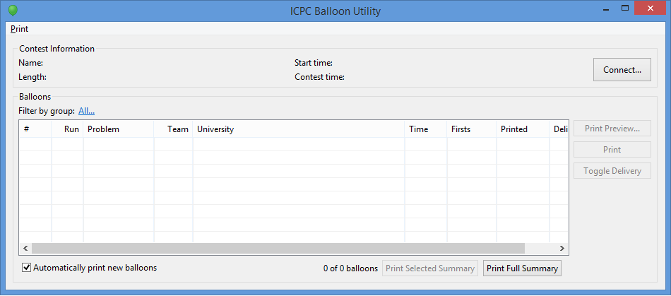
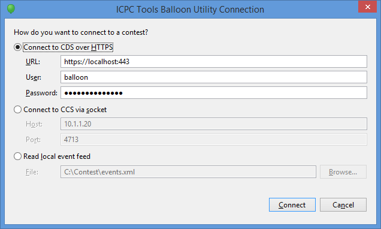
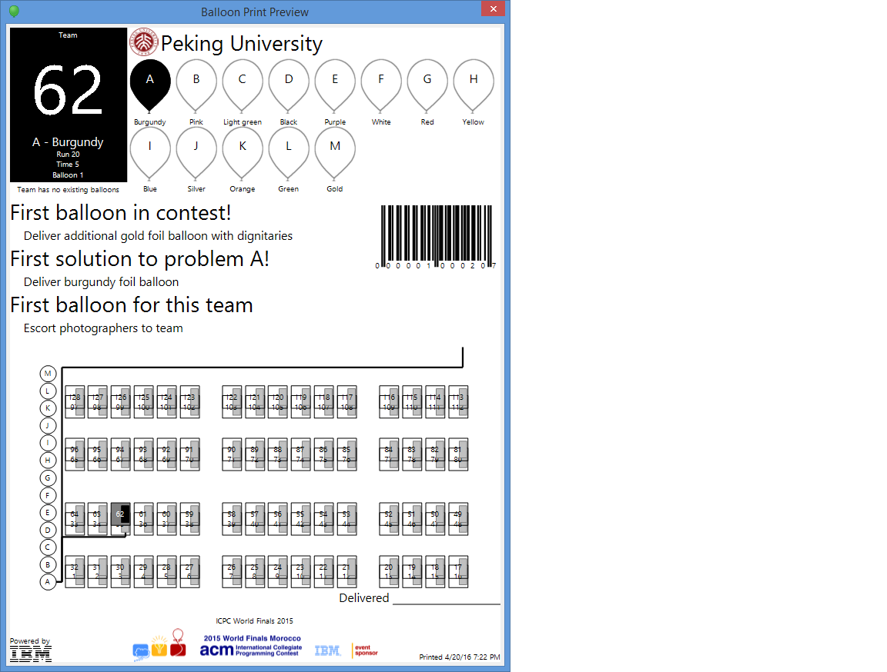
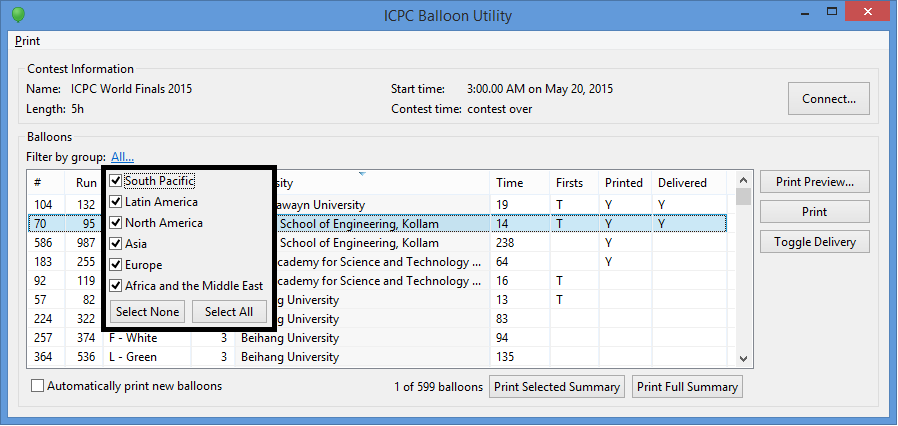

# The ICPC Balloon Utility 

{width=50}

An ICPC Tool

## Introduction

The ICPC Balloon Utility (BU) is a tool for keeping track of balloons earned by contest teams
for successful run submissions. It receives submission information from one of several
input sources, displays information about each submission (such as the problem, team,
run ID, school, submission time, etc.) and optionally automatically prints "balloon
notification" messages to assist runners in delivering balloons. It also provides 
runners with an interactive mechanism for tracking delivered balloons, and is even
capable of printing maps showing runners where to go find the appropriate balloon
and where on the contest floor the receiving team is located (although instructions
for configuring it to do that are beyond the scope of this introductory guide).

The following shows a screen shot of the Balloon Utility main screen, after it has been 
loaded with run submission information from a Contest Control System:

## Using the Balloon Utility

### Installation

To install the Balloon Utility, download its distribution package from the [ICPCTools website](https://tools.icpc.global/)
and unzip it to any convenient location. 
The BU is a Java program. The distribution is a self-contained package which contains 
all the Java libraries and other components necessary to run the Balloon Utility.
(Note that Java version 17 or higher must also be installed on the machine.)

### Execution

The Balloon Utility distribution includes a set of scripts which can be used to launch the program,
balloon.bat for Windows platforms and balloon.sh for macOS and Linux.
To start the BU, open a terminal window (command shell), 
change to the folder where you unzipped the distribution, and type the name of the
appropriate script. The scripts do not require any parameters, although adding
"--help" will generate a mildly-useful message, and "--clean" will remove any saved
balloon data. For more advanced use, you can enter a Contest API URL, user, and
password to connect directly to a Contest API server upon startup.

### Input Data Sources

When the BU starts it displays a screen similar to the following:

(If existing data was loaded it will be displayed in the screen; otherwise the
screen will be unpopulated as shown above.)

In order to use the BU once it is started, it must 
be connected to the output of a _Contest Control System (CCS)_.
The Balloon Utility will work with any CCS or the CDS which is 
compliant with the [Contest API Specification](https://ccs-specs.icpc.io/contest_api).
Tools known to produce compliant event feeds include
[Contest Data Server](https://tools.icpc.global/cds/), 
[DOMjudge](https://www.domjudge.org),
[PC-Squared](http://pc2.ecs.csus.edu/pc2), and 
[Kattis](https://www.kattis.com);
other Contest Control Systems may also produce compatible event feeds and
hence work with the Balloon Utility.

The BU is capable of operating with contest data obtained from one of two
different sources: a Contest API source (e.g. CCS or CDS) or a local contest path.
If you don't specific a source on the command line you will be prompted on startup.

Connecting the BU directly to a running (compatible) CCS or CDS is done using the REST
selection in the dialog and entering a valid Contest API URL, user, and password.
The BU can be connected to a folder or event feed file using the Disk selection.

### Operating the Balloon Utility

Each time a successful-run notification arrives in the event feed the BU will display the
run information in its grid. If the run represents special conditions, such as being the
first solution for a Team (T), Problem (P), Region or Group (R), or in the entire 
Contest (C), corresponding flags are displayed in the "Firsts" column.
The display grid can be sorted on any column by clicking in the corresponding column header.

One of the most common uses of the BU is for printing "Balloon Notification" messages for runners
delivering balloons to teams.
Balloon Notification printouts contain information identifying the team (by name and number),
problem (by letter), the run submission that earned the ballloon (by run ID and submission time)
and the color of the balloon which should be delivered. 

Balloon Notifications may also contain additional information such as how many other balloons 
the team has and any special award categories associated with the new balloon (such as an
indication that it is the team's _first_ balloon or that the balloon represents the first
solution (by any team) of the specified problem.
Balloon Notifications can also be configured to print a map showing where the team is located
on the contest floor, although the mechanism for configuring this map is not documented at this time.

A sample Balloon Notification is shown below: 

To select the printer to be used for printing Balloon Notifications,
pull down the "Print" menu in the upper left corner of the main screen and
select "Configure Printer"; this will display a list of
all printers known to the underlying system and any of these can be selected for use by the BU.

The selected printer can be changed
at any time (again, using the Print menu), and the same menu also allows for sending a 
"Test Message" to the printer to be sure it is working.

The _Automatically print new balloons_ checkbox at the bottom of the main screen can be used to
enable or disable automatic printing; if enabled, then whenever a new successful-run notification
is received in the event feed the BU will automatically print a new Balloon Notification message
to the currently-configured printer.

Selecting one or more rows in the grid (by clicking on them) and then pressing _Print Preview_
will print an on-screen version of the Balloon Notification(s) for the selected row(s).
Selecting one or more rows and pressing _Print_ will send Balloon Notification(s) for the
selected rows to the currently configured printer (even if the notifications have previously been printed).
Whenever a notification has been printed (including as a result of "automatic printing"),
the BU places a "Y" indication in the "Printed" column.

The _Print Summary_ buttons allow you to print a complete list of balloons for verification, either
a list for rows currently selected in the grid or a complete summary of all balloon notifications
for the contest up to the moment. This can be used for example to verify that the balloons which
should have been sent to a given team are actually present on the contest floor 
(by sorting on the Team column and then selecting all runs for that team followed by pressing
_Print Selected Summary_), or to check that all of the balloons on the contest floor match what
they should be.

The "Delivered" column is used to track when balloons have actually been delivered to teams.
Each time a runner delivers a balloon, they should select the corresponding row in the grid
and click the _Toggle Delivery_ button. This will insert a "Y" in the "Delivered" column,
providing an easy way to keep track of delivered notifications. The "Y" notification can
be removed if desired by selecting the row and clicking "Toggle Delivery" again.
Note also that Balloon Notification printouts have a "Delivered By" signature space near the
bottom to allow balloon runners to record that they delivered the corresponding balloon.

The _Filter by group_ label (just above the main screen grid, on the left side) can be used to restrict the
balloons which are processed by the BU. Clicking on the text next to the label (it shows as 
"All..." in the following screenshot) produces a drop-down list of the
currently-defined "groups" (also called "regions") defined in the contest, similar to the following:

Disabling one or more groups (by unchecking the corresponding checkbox) suppresses the Balloon Utility's 
processing of Balloon Notifications for the disabled group(s). This allows the balloon handling crew
at contests taking place simultaneously at multiple sites to avoid having to deal with Balloon Notifications
for teams which are not at their site.

Note that the definition of the groups in a contest comes from data in the event feed read by the BU; 
groups cannot be defined within the Balloon Utility.

#### Notes

Test or rehearsal contests often have multiple copies of the same problem, e.g. there are 6 problems A-F,
but each pair of A and D, B and E, and C and F are identical. If these problems are marked as duplicates 
by the Contest Control System (by having the same problem UUID) then by default the balloon utility will
only print a balloon for first solution (either A or D) from each pair. To disable this behaviour, enable the
"Print balloons for problems with matching UUIDs" preference (and restart if there are existing submissions).