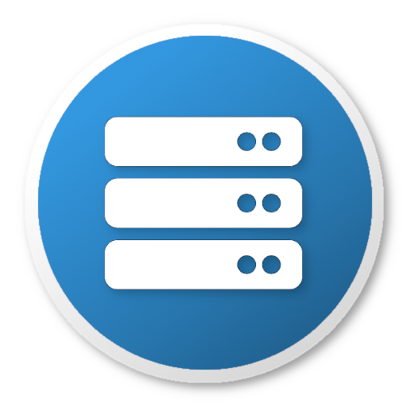

# The ICPC Contest Data Server (CDS)



An ICPC Tool

## Introduction

The Contest Data Server (CDS) is a software component designed to allow secure, 
authenticated HTTP connections to contest data residing on a contest network.
It provides https://en.wikipedia.org/wiki/Representational_state_transfer[REST] 
entry points for accessing a variety of contest-related services, allowing clients
to access those services via standard HTTP requests.

The CDS provides authentication services using configuration
data supplied by the Contest Administrator (CA). Authenticated users can be assigned _roles_ by the CA; user access
to specific services is governed by the role(s) assigned to them.

The set of services made available by the CDS is dependent on the facilities available on the contest network.
Examples of services which the CDS knows how to support (assuming that the contest network provides the back-end data
required and that the CA configures their use into the CDS) include

* an overview description of the contest (title, date, etc.)
* a Countdown Clock for the start of the contest
* the current contest time (time remaining in the contest)
* the contest configuration, as defined by any of several standard file types (contest.yaml, problemset.yaml, teams.tsv, etc.)
* the current backup copy of any specified team's home directory
* the event feed as provided by the Contest Control System (CCS)
* images for each team and for each team's University Logo
* "reaction videos" showing a team's web camera at the moment they received a run submission response from the judges
* the current contest scoreboard
* an RSS feed for the contest
* the set of files which a team submitted to the judges for a specific run

Many of these services are described in more detail in the following sections of this document; additional information
regarding CDS services can be found on the CLI Wiki https://clics.ecs.baylor.edu/index.php/CDS[CDS page].

Note: many of the data access functions provided by the CDS require the use of a compatible
_Contest Control System_ (CCS) for running the contest. See the _Competitive Learning Institute_'s
https://clics.ecs.baylor.edu/index.php/Contest_Control_System[Contest Control System specification]
for details. See the documentation for the CCS being used by your contest to determine whether it meets the CLI CCS specification.

## Using the CDS

### Overview

The CDS is a Java Enterprise Edition (JavaEE) web application; an instance of the CDS operates 
by being deployed into a JavaEE application server. The ICPCTools distribution of the CDS comes with the 
https://developer.ibm.com/wasdev/websphere-liberty/[IBM WebSphere Application Server Liberty Profile] (WAS/WLP) included in it;
the entire CDS can be run using the embedded WLP system and no other external Application Server is needed.

Alternatively, the CDS can be deployed under other Application Servers
such as http://tomcat.apache.org/[Apache Tomcat], 
http://jbossas.jboss.org/[JBoss] (now http://wildfly.org/[WildFly]), or
http://www.eclipse.org/jetty/[Jetty]. However, the mechanisms and requirements for deploying web applications 
to application servers differ between servers.
This guide does not attempt to provide tutorial details for such alternative deployments; see the Appendices and
the documentation for your particular application server for additional information.

### Installing the CDS 

To install the CDS, download a copy of the latest version from the https://icpc.baylor.edu/icpctools/[ICPCTools web page]
and unzip it into any convenient directory. That's it!

### Configuring the CDS

The unzipped CDS contains a single folder named _wlp_ ("WebSphere Liberty Profile").
Among the subfolders therein you will find both _bin_ and _usr_ folders.
The _bin_ folder contains commands (see below) which are used to start and control the WLP application server 
and the applications it contains (such as the CDS application).
The _wlp/usr/servers/cds_ folder holds the "WAR" file which contains the CDS executable code (under the _apps_ folder),
and also holds the _configuration files_ which manage the CDS configuration.

The CDS is configured via a combination of two things: the JavaEE application server-specific
configuration mechanism (for ports, virtual hosts, users, etc.),
and XML configuration files for CDS settings (such as which 
Contest Control System (CCS) to connect to, user account passwords, etc.).

#### Configuring the WLP JavaEE Server

The WebSphere Liberty Profile (JavaEE server) configuration is managed by a file named _server.xml_ located in the application folder
(e.g. _cds_) under the _usr/servers_ folder. The _server.xml_ file contains five important sections:

* a specification of the _HTTP and HTTPS ports_ used by the server.
+
** The ports associated with HTTP and HTTPS requests can changed by editing the _<httpEndpoint>_ entry in the _server.xml_ file;
the defaults are 8080 and 8443 respectively.
* a list of the _security roles_ and _user names_ associated with those roles.
+
** The security roles and associated user names can likewise be edited (but be aware that some ICPCTools assume that
certain users are associated with certain roles). See below for further information about user roles.
* the location of the _users.xml_ file which defines the passwords for user accounts.
+
** The passwords assigned to specified user names can be changed by editing the _users.xml_ file.
* a https://en.wikipedia.org/wiki/Java_Naming_and_Directory_Interface[JNDI] (Java Naming and Directory Interface) entry giving the path
from which to load the CDS configuration details.
+
** The _server.xml_ configuration file must contain a single JNDI entry named "icpc.cds.config" that gives the path to load the
CDS configuration and other files required by the CDS. The CDS comes preconfigured with a JNDI entry pointing to the current folder,
which contains the file _cdsConfig.xml_ (see below).
* a list of _features_ used by the JavaEE server (not normally changed by CDS users).


#### Configuring CDS User Roles

The _server.xml_ file by default defines four _security roles_ and several _user names_ occupying those roles, as follows:

.CDS Roles, Purpose, and User Names
|===
|Role |User Names 

|admin
!Super user
|admin

|blue
!Read-only access to all data
|blue

|balloon
!World Finals specific
|balloon

|trusted
!Data accessible to trusted tools
!myicpc, live

|public
!Data accessible to anyone
|public, presentation
|===

The user names can be changed to anything you wish and can be added or removed, but must remain be in an appropriate "CDS role".
The CDS verifies that authenticated users have the appropriate role before granting access to a specific CDS service.
(The "blue" role name comes from the ICPC World Finals network configuration, where core components occupy a network 
segment called the "Blue Network"; the names "live", "myicpc", and "presentation" refer to groups or functions at the World Finals.) 

The Contest Administrator can add, delete, or change the roles and/or the user names defined in the _server.xml_ file -- but as noted above, 
be aware that some ICPCTools rely on a user being part of a specific role.

#### Configuring CDS Services

In addition to the general configuration items described above, the CDS must be made aware what specific services are available 
on the contest network as well as how it should access those services in order to expose them to clients.
This configuration is done via an XML file named _cdsConfig.xml_,
located in the _usr/servers/cds_ folder. 
The _cdsConfig.xml_ file contains a root element *<cds>* which in turn contains a separate "service-defining" XML element for each 
service which the CDS knows how to provide. All nested elements and attributes are optional except
for the _contest location_ attribute, and unknown elements or attributes are ignored - 
this allows you to easily rename or comment-out an element to add or remove a service.
If you save changes to _cdsConfig.xml_ while the CDS is running the changes will be automatically applied after a few seconds.

A simple example of a _cdsConfig.xml_ file is shown below.

....
  <!-- specify the location of the folder holding the contest data package (used to find config files, resources, etc.) -->
  <contest location="/Users/me/contests/test" recordReactions="true">
    <!-- Configure communication with the CCS -->
    <ccs url="http://myccs/api/contests/finals" user="admin" password="adm1n"/>
  </contest>
</cds>
....

The above file specifies two "service elements": <contest>, with its (required) _location_ attribute which points to the
location of the Contest Data Package (see below), and <ccs>, whose attributes describe how to connect to the Contest Control System.
(See below for further description of the attribute values in the sample file.)

##### CDS Configuration Service Elements

The CDS supports a variety of service-defining XML elements in the _cdsConfig.xml_ file.
The supported service-defining elements and their structure and functions are described below.

###### <contest> Element

....
<contest id="id" location="path" recordReactions="false"/>
....

The optional _id_ attribute specifies the contest id to expose, which will override any contest id used by the underlying CCS or event feed.
If unspecified, the id will be picked up from the CCS' Contest API endpoint (e.g. 'finals' in 'http://api/contests/finals') or by the last
segment of the location (e.g. 'test' in 'C:\icpc\test').

The _location_ attribute specifies the full path to a *_contest data package_* (CDP) defining the organization of the contest
(config files, logos, etc.). See the https://clics.ecs.baylor.edu/index.php/CDP[CLI CDP specification] for details on how
to organize a Contest Data Package. Note that _the location attribute is required_; the CDS will not 
operate if it does not have a folder to store contest related data, even when it is empty and getting all data from the CCS.

** recordReactions: an optional string ("true" or "false" [default]) instructing the CDS whether or not to record reaction videos
and make them available through the contest API.
+
If the value of this attribute is "true", then clients will be able to access reaction videos (60-second snippets following the moment a
team sent a submission to the judges). The value of the _recordReactions_ attribute should only be set "true" if the
_webcam_ URL template has been set and team machines are actively streaming webcam video.

The optional _hidden_ attribute specifies that a contest should be hidden from contest listings unless the request is coming from
an admin or blue user. This allows contest administrators to configure the next contest prior to broadcasting it's existence. Note
that this is just meant to allow some configuration to happen in private, not a way to completely secure these contests.

###### <ccs> Child Element

```
<ccs
    url=""
    user=""
    password=""/>
```

The optional <ccs> element is used to configure the CDS's access to the Contest Control System.
The attributes associated with this element are as follows:

* url: the URL to a REST-based CCS

* user: the user account name to log into the CCS

* password: the password for the CCS user account

If the <ccs> element is present then the CDS will use the CCS as the master source of all contest data. The local
<contest> folder is used as an initial source, cache, and can provide additional data (e.g. logos if the CCS does
not provide those) but the event feed and all other contest data will come from or be overridden by the CCS.

###### <ccs> Child Element (deprecated)

```
<ccs
    eventFeed=""
    startTime=""
    user=""
    password=""/>
```

Only one <ccs> element may be used. This alternate and deprecated <ccs> element is provided to connect to older
CCSs that do not support the CLI Contest API. It provides support for the final XML Event Feed specification
(https://clics.ecs.baylor.edu/index.php?title=Event_Feed_2016) and Contest Start Interface
(https://clics.ecs.baylor.edu/index.php?title=Contest_Start_Interface).
The attributes associated with this element are as follows:

* eventFeed: (host:port) the IP address and port at which the CDS should contact the CCS to obtain its event feed

* startTime: the optional URL at which the CDS should contact the CCS to obtain the scheduled start time of the contest.
The return start time is expected to be in mSec since the start of the Unix epoch (i.e., since midnight January 1st, 1970)

* user: the optional user account name to log into the CCS Start Interface

* password: the optional password for the CCS Start Interface user account

###### <video> Child Element

```
<video
    id="43"
    desktop="http://..."
    desktopMode="lazy"
    webcam="http://..."
    webcamMode="eager"
    audio="http://..."
    audioMode="eager"/>
```

The <video> element is used if your contest supports team desktop (screen), webcam, and/or audio streaming, in which case
the CDS can make these streams available to clients.
Also, if the contest does support team webcam streaming, then the CDS can be instructed to record "reaction videos", which are 60-second
snippets of webcam video started at the moment a team submits a run to be judged (which, assuming the automated judging result is
returned to the team within 60 seconds, will have the effect of capturing the team's "reaction" when they receive the judgment). 

The attributes associated with the <video> element are as follows:

* id: an optional team id. If this is specified, the video URLs below will be configured only for the given team. If not specified then
the video URLs will be configured for all teams.

* desktop: an optional template for the URL at which the CDS should access team desktop streams. The URL template may include the characters
_{0}_, which will be replaced with the team id by the CDS.
For example, if each team machine was on a single /24 subnet (i.e., the first three octets of the team machine IP addresses were
all the same) and further the last octet of each team machine's IP address was the team number, then a _desktop_ attribute of the
form _\http://a.b.c.{0}:9090_ would direct the CDS to access each team's desktop at port 9090 on the machine with IP address a.b.c.X, where
'X' was the team id (typically team number).
As another example, _webcam_ URL templates of the form _\http://host/{0}_ or _\http://host:{0}_ would direct the CDS to access each team's webcam
at a different web-based context root or port, respectively.
Note that the URL template mechanism works the same for the _desktop_, _webcam_, and _audio_ attributes.
In any case, it is the responsibility of the Contest Administrator to ensure that each team machine is actively outputting desktop video,
webcam video, and/or audio streams at the specified URL. (See the Appendices for information on setting up video streaming for team machines.)
In order to support easy testing, the desktop attribute may also point to a local file instead of a URL, e.g. "c:/desktop_sample.m2ts".
Desktop and webcam files for testing should be roughly 1 min in length as they're streamed every 60s.

* desktopMode: an optional string ("lazy", "lazy close", or "eager") that tells the CDS how to access the desktop stream. "Lazy" will connect only
when the first client requests the stream and disconnect when the last client drops. "Lazy close" will only connect when a client requests the
stream but will stay connected afterward, thus allowing any subsequent clients to connect faster. "Eager" will connect immediately and stay
connected even when there are no clients - using up lots of resources, but allowing clients to always connect as fast as possible.

* webcam: an optional template for the URL at which the CDS should access team webcam streams. The URL template may include the characters _{0}_,
which will be replaced with the team id by the CDS. See the desktop attribute for further details.

* webcamMode: an optional string ("lazy", "lazy close", or "eager") that tells the CDS how to access the webcam stream.
See the desktopMode attribute for further details.

* audio: an optional template for the URL at which the CDS should access team audio streams. The URL template may include the characters _{0}_,
which will be replaced with the team id by the CDS. See the desktop attribute for further details.

* audioMode: an optional string ("lazy", "lazy close", or "eager") that tells the CDS how to access the audio stream.
See the desktopMode attribute for further details.


###### <test> Child Element

```
<test
    countdown=""
    startTime=""
    multiplier=""/>
```

The <test> element is used to enable test (_contest playback_) mode. 
When you enable test mode the CDS will attempt to play back a past contest based on the content of
the specified _contest location_ (see the <contest> element, above) -- meaning, the CDS will provide 
responses to service requests as if the requested data came from the specified contest, 
at the time rate and sequence order in which they actually occurred in that contest. 
The attributes associated with this element are as follows:

* countdown: a string giving the number of seconds before the contest playback should start
* startTime: a specific start time, e.g. "2018-02-19T12:30:00.000-05"
* multiplier: a string giving a numeric multiplication factor for contest time; for example, "50.0" will 
playback a 5-hour (300-minute) contest in 6 minutes.

Only one of the countdown and startTime attributes can be set at a time!
Several services normally require additional hardware or software to run; e.g. /video/desktop requires
a team machine that's capturing and streaming desktop video. To avoid this requirement during a test (contest playback),
 the CDS allows you to put into the contest
location (CDP) a _test_ folder that contains some sample data. The following is a list of the sample files that are supported:

*   reaction.m2ts
*   submission.json
*   backup.tar.gz

###### <video> Element

```
<video
    name="ICPC Live"
    url="http://..."
    mode="lazy"/>
```

The global <video> element is used if you want to add additional video streams into the channel mixer.

The attributes associated with this <video> element are as follows:

* name: an name to represent this video stream

* url: a video URL at which the CDS can access a video stream

* mode: an optional string ("lazy", "lazy close", or "eager") that tells the CDS how to access the desktop stream. "Lazy" will connect only
when the first client requests the stream and disconnect when the last client drops. "Lazy close" will only connect when a client requests the
stream but will stay connected afterward, thus allowing any subsequent clients to connect faster. "Eager" will connect immediately and stay
connected even when there are no clients - using up lots of resources, but allowing all clients to connect as fast as possible.

###### <domain> Element

```
<domain>
  <user name="presAdmin"/>
  <user name="presentation1"/>
  <user name="presentation2"/>
</domain>
```

The global domain element is used if you have multiple presentation administrators and clients and want to set up separate
administrative domains. You can define multiple domains. Each domain should have at least one admin or presentation admin user,
and at least one non-admin user that will be used to display presentations.

By defining a domain you are restricting a set of administrators who may control a given set of user's presentations. For example,
the domain above means that only presAdmin may control presentation1 and presentation2 - other administrators will not see these
clients unless there are other domains defined. For more complex scenarios domains can overlap in any way, e.g. the primary admin
may be included in more than one domain or presentation users may be in multiple domains to allow more than one admin to control them.

The attribute associated with the <user> element is as follows:

* name: the name of a user, which must match one of the existing users.


### Starting the CDS

The CDS distribution includes a folder _bin_ (under the _wlp_ folder) that contains a variety of scripts and other tools for
performing CDS-related functions. Among these scripts are a Bourne shell script named _server_, and a corresponding 
Windows batch file named _server.bat_.
These are the scripts that are used to start the WLP application server on the corresponding platform. 
(Note that this structure allows the same command, "_server_", to be used regardless of the platform.)

The "server" script requires one or more parameters telling the WLP application server what to do. In particular, the following table
shows the most common commands for running the CDS on the WLP Application Server (the listed commands assume the user is in the _wlp_
folder and are shown in their Linux form; replace the "/" characters with "\" on a Windows machine).

.CDS Server Startup Commands
|===
|Command |Effect 

|*./bin/server start cds*
|Start the CDS in background mode (allows running other commands from the same prompt, but discards server console output)

|*./bin/server stop cds*
|Stop the CDS

|*./bin/server run cds*
|Start the CDS in foreground mode (ties up the console window, but allows display of server output)

|*./bin/server status cds*
|Displays the current status of the CDS

|*./bin/server list*
|List the servers which WLP knows about

|===


## Accessing CDS Services

Once the CDS is configured and started, it provides REST entry points (URLs) which clients can access to obtain services. 
The full form of a URL is always

 <protocol>://<host>:<port>/<contextRoot>/<pathWithinApp>

The CDS defaults to using HTTP and HTTPS protocols at ports 8080 and 8443 respectively 
(although the port is configurable, as described earlier), 
and the default _contextRoot_ for the CDS (that is, the place where the application server expects to find
application pages) is "/", 
so a typical URL for accessing CDS services is *_\https://<host>:8443/<serviceName>_*, 
where _<host>_ is the IP address of (or a hostname which resoves to the IP address of) your CDS machine, and _<serviceName>_
is the name of one of the services provided by the CDS. 

For example, assuming the CDS is running on a machine with hostname "_cds_" under the application server's 
"/" context root (the default), a client could access the "overview" service by referencing the following URL:

 https://cds/overview
 
Similarly, accessing

 https://cds/images/team/3
 
would return the picture for team #3, and accessing

 http://cds/video/camera/17
 
would connect to the video camera stream for team #17. (Note that all of the above examples presume that the corresponding
service has been configured into the CDS, as described earlier.)

A complete list of the services provided by the CDS can be found on the
https://clics.ecs.baylor.edu/index.php/CDS[CLI CDS] Wiki page.

## Updating ICPC Clients

When using any of the ICPC Tools clients (presentations, balloon printer, coach view, and resolver) with the CDS,
they will check the CDS for newer versions on startup, and will automatically download and replace
themselves if a newer version is available.
To use this function, download the zip file of a newer version of a tool and place it in the CDS's config/present folder.

For example, if a balloon client had the 2.2.87 version installed and you downloaded the 2.2.90 version and placed
it at wlp/usr/servers/cds/config/present/balloonUtil-2.2.90.zip, the next time the balloon client is started or
restarted it will update to 2.2.90. The presentation admin can be used to force a restart of any client.


## Appendix

### Setting up Video Streaming on Team machines

In order for the CDS to be able to respond to video service requests (for example, access to team machine desktop or 
team webcams), two things must be done. First, the CDS must be configured 
to look for team desktop and/or webcam feeds 
(see the description of the <video> service element in the _cdsConfig.xml_ file, above).
Second, the Contest Administrator must arrange for team machines to 
generate appropriate video streams on the URLs which are specified in the <video> service element.

Any mechanism can be used to generate the video streams on the team machines. At the World Finals, the free open-source package
called http://www.videolan.org/vlc/index.html[*_VLC_*] is used.
Specifically, each team machine has VLC installed, and two instances of VLC are running on each team machine: one to generate
the team desktop stream, and a second to generate the team webcam stream. The commands used to generate these streams are shown below.

Note that while this works at the World Finals, it is possible you will have to do some tweaking to get it to work in your
environment. In particular, for example, the commands contain references to specific image resolutions.
In addition, note that the commands are run using Linux "sudo" at the World Finals. That is, the actual command used is
```
 exec /usr/bin/sudo -u camera -H vlc_command > /dev/null 2>&1 &
```
where _vlc_command_ represents the VLC command shown below.
 
In any case, the commands shown below will hopefully be enough to point you in the proper direction.

#### Team WebCam Streaming

The following single-line command is used at the World Finals to start a stream on port 8080 containing the team's web camera output:
```
 vlc -I dummy -q v4l2:///dev/video0:width=1280:height=720:aspect-ratio="16:9" 
 :input-slave=alsa://plughw:1,0 --sout '#transcode{venc=x264{keyint=15},vcodec=h264,
 vb=0,scale=0,fps=30,acodec=mpga,ab=128,channels=2}:http{mux=ts,dst=:8080}'
```

#### Team Desktop Streaming

The following VLC command is used at the World Finals to start a stream on port 9090 showing the team's screen:
```
 vlc -I dummy -q screen:// --screen-fps=30 --sout "#transcode{venc=x264{keyint=15},vcodec=h264,vb=0}:http{mux=ts,dst=:9090/}"
```

### Deployment Under Other Application Servers

The CDS distribution comes packaged with an embedded Liberty Profile application server.
The CDS application component of this distribution is 
contained in the file _CDS.war_ in the _wlp/usr/servers/cds/apps_ folder.

In principle it should be relatively easy to "port" the CDS to a different application server by installing the _CDS.war_ file
in the new application server according to that server's rules (along with configuring the new application server in ways
analogous to the settings described earlier in this document -- for example, specifying the location of the _cdsConfig_ file
to the new application server).

However, as of this writing we have not explicitly attempted such a port. We would be very 
interested in hearing about user experiences in porting the CDS to other application servers, especially common servers such as 
*Tomcat*, *Jetty*, or *JBoss/WildFly*.

If you have any experience in attempting such a port, please feel free to update us about it by sending mail to _icpctools-dev@ecs.csus.edu_.