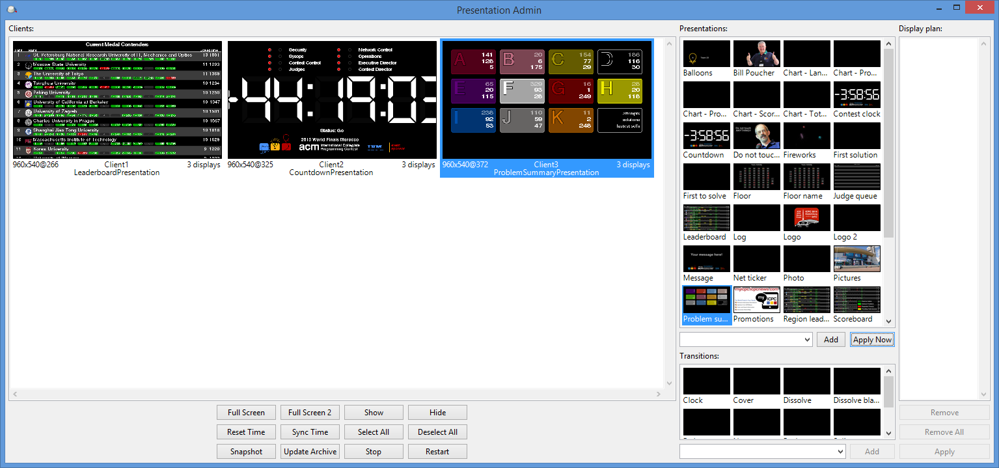

# The ICPC Presentation Admin

{width=50}

An ICPC Tool

## Introduction

The _Presentation Admin_ is one of the components
comprising the ICPC _Presentation System_.
The other major components of the Presentation System
are the _Presentation Client_ and a collection of _presentations_.

The ICPC Presentation System defines a large number of built-in
"presentations", each of which displays programming contest-related
data in some fashion. For example, one presentation shows the
_current contest scoreboard_, scrolling it automatically from the current
leaders down through all contenders and then repeating.
Other presentations show data such as the languages being used, 
the current number of solutions to each contest problem,
notifications that a particular team has just solved a particular problem,
and so forth, all updating in real time based on input from a 
[Contest Control System (CCS)](https://ccs-specs.icpc.io/ccs_system_requirements).
There are also pre-defined presentations for showing a variety of user-selected
data such as team photographs, contest logos and related images,
local sites of interest, fireworks for the end 
of the contest, and so forth.

The ICPC Presentation System will work with any 
CCS that produces an event feed which is 
compliant with the [Contest API](https://ccs-specs.icpc.io/contest_api).
Systems known to produce compliant event feeds include 
[PC-Squared](http://pc2.ecs.csus.edu) and 
[Kattis](https://www.kattis.com); 
other Contest Control Systems may also produce compatible event feeds and 
hence work with the Presentation System.

Presentations are bundled together in a _jar_ file, with several
presentations in any particular jar. The Presentation System includes 
_Presentation Clients_ which are able to accept presentation jar files
and display any presentation on its screen.
Clients can be started in "stand-alone" mode by giving them a list
of presentations, which are then automatically bundled into a jar and 
provided to the client.
(See the separate documentation on the Presentation Client for
more information about running a Client in stand-alone mode.)

The Presentation Admin knows what presentations are currently
defined in the Presentation System, and also knows what Presentation Clients
are currently connected and available to be given a presentation set (jar).
The Admin allows the user to select any subset of the available presentations
and "assign them" dynamically to any selected set of clients.
This makes it particularly easy for one person to control a variety of different 
displays during a contest.

Presentation Clients and the Presentation Admin communicate through a server
called the _Contest Data Server (CDS)_; there must be a CDS running in order
to use the Presentation Admin to control Presentation Clients.
(See the separate [Contest Data Server](https://tools.icpc.global) tool documentation
for further information on how to set up and run a CDS.)
Presentation Clients connect to the CDS and wait for instructions; the Presentation Admin
connects to the same CDS and issues commands which control the display contents of the clients.

The following image shows the Presentation Admin GUI. On the left appear the presentation clients
(of which there are three in the example); toward the right appear thumbnail sketches representing
available presentations. Client 1 in the example is currently showing a presentation called
Leaderboard; Client 2 is showing a Countdown clock presentation; and Client 3 is showing
a Problem Summary presentation which gives details of solutions per problem. Each of these 
clients would typically be running on a separate machine whose display output 
drives a large monitor or projector made accessible to an audience.



(Note: the above screen shot is a bit out of date and needs to be updated...)

## Using the Presentation Admin

### Installation

To install the Presentation Admin, download the Presentation Admin 
distribution package from the [ICPCTools website](https://tools.icpc.global)
and unzip it to any convenient location. 
The Presentation Admin itself is a collection of Java programs (components).
The distribution is a self-contained package which contains 
all the Java libraries and other components necessary to run the Presentation Admin
(Java version 17 or higher must also be installed on the machine).

### Configuration

When the Presentation Admin starts (see below), it requests from a CDS 
(Contest Data Server) a list of available
ICPC Presentations for distribution to running Presentation Clients.
This means of course that there must be a CDS running in order for the Presentation
Admin to connect; see the separate documentation on the ICPC CDS tool for further information.

### Startup

The Presentation Admin distribution includes a set of scripts which can be used to launch the program,
presAdmin.bat for Windows platforms and presAdmin.sh for macOS and Linux.
To start the Presentation Admin, open a terminal window (command shell), 
change to the folder where you unzipped the distribution, and type the name of the
appropriate script.

The scripts expect three parameters.
The first parameter is the HTTPS URL of the Contest Data Server which the Admin should contact.
The second and third parameters contains the user login name and password for the CDS.

Specifying a "--help" parameter will generate a short usage message.

### Interactive Operation

Once the Presentation Admin is started, it displays a screen similar to
the one above, showing the available clients on the left and the available
presentations on the right.
Note: clients must be started separately in order for them to be recognized
by the Admin; see the separate documentation on the Presentation Client for
details on how to start a client which will register with the Admin;
in particular, refer to the section on the "client.bat" script in the
Presentation Client tool documentation.

Once the Admin has a list of clients and presentations, the following 
operations are available.

#### Basic Operations

* Assign a presentation to one or more clients:
  * Select a client (in the "Clients:" panel on the left) by clicking on it with the mouse.
Holding down CTRL while clicking adds clients to the selection; 
the _Select All_ and _Deselect All_ buttons can also be used for selection control. 
  * Select a presentation from the "Presentations:" list on the right by clicking on it (note that only 
one presentation can be selected at a time; see _Display Plans_, below for details on
assigning multiple presentations to a client).
  * Click _Apply Now_ to apply the selected presentation to the selected client(s).
This will cause the selected clients to begin displaying the selected presentation.

* Temporarily disable a client presentation:
  * Select one or more clients, then click _Hide_. This causes the selected client(s)
to switch to a blank screen. Client presentations can be changed on the Admin
while the client is in "hide" mode. Click _Show_ to cause the selected client(s) to begin
showing their assigned displays again.

* The additional buttons in the panel below the client list allow you to perform various actions 
on the currently selected clients:
  * _Full Screen_ causes the client (which typically starts in a window) to expand to full screen exclusive mode.
  * _Full Screen 2_ expands clients on a second/external display to full screen. Does nothing if you only have one screen.
  * _Sync time_: By default, all clients are initially synced to the system clock time on the CDS on startup. 
If client machines drift out of time sync, this can be used to force them back in sync with the CDS.
  * _Reset Time_: resets the client's clock to their local system clock.
  * _Snapshot_ obtains a screen-grab from the selected client(s) and displays them each in separate
windows on the Presentation Admin machine. This allows you to see the client presentation in
detail without having to actually go look at the client machine.
  * _Stop_ instructs the JVM running the presentation on the selected client(s) to exit (which terminates
the presentation client).
  * _Restart_ instructs the JVM running the presentation to restart. This causes the client to 
lose its current presentation and re-register with the Presentation Admin.


#### Display Plans

The Presentation Admin supports the ability to define _display plans_.
Display plans are organized sequences of presentations and
transitions. Users can build arbitrary display plans
and then assign them to selected clients. The clients will then
cycle from one presentation to the next one (in the order in which they appear
in the display plan), applying each successive transition (also in the order in
which they appear in the display plan) between each presentation.

The rightmost panel on the
Presentation Admin shows the "current display plan" (which is 
initially empty). The following operations
are available for defining and applying a display plan.

* Add a presentation to the current display plan by selecting (clicking on)
it and then clicking the "Add" button below the list of presentations.
The selected presentation will appear in the Display Plan panel.
Multiple presentations may be added to a display plan, but they must
be selected and added individually.

* Add a transition to the display plan by clicking on one of the
predefined transitions shown in the Transitions panel (below the
presentations list) and then clicking the "Add" button at the bottom
of the Transitions panel.

* Remove a presentation from the display plan by selecting it
in the Display Plan panel and then clicking "Remove"
(or "Remove All") at the bottom of the Display Plan panel.

* Apply the current display plan to the currently selected client(s)
by clicking "Apply" at the bottom of the Display Plan panel.
This causes the sequence of presentations and transitions 
in the display plan to become the content of the selected client(s).

The relative positions of presentations and transitions in the Display Plan
doesn't matter; the client will cycle through all the presentations,
in the order in which they appear in the display plan, 
applying transitions between presentations in the order in which the transitions
appear in the display plan.
If there are more transitions than presentations then the last few transitions are ignored
(that is, the client starts again at the beginning of the ordered list of
transitions when it cycles back to the beginning of the ordered list of presentations). 
If there are fewer transitions than presentations in the display plan then the client
cycles through the transitions again as it continues with the presentations.

#### Properties

Some presentations and transitions have _properties_ which affect how they appear.
For example, the "Message" presentation has a property defining the message
(text) which will be displayed.
Similarly, the "Cover" transition has a property which defines the direction
in which the next presentation will cover the previous presentation during
a display plan transition.
Certain properties can be changed by the user,
allowing dynamic alteration of presentation content and transition operation.

To change a presentation property, select the presentation and then click
the drop-down "Presentation Properties" list at the bottom of the Presentations panel,
which will show the properties associated with the currently selected
presentation. Entering a new value for the property will then cause that value to be 
assigned as the corresponding property value for the presentation.

Similarly, to change a transition property, select the transition and then click
the drop-down "Transition Properties" list at the bottom of the Transitions panel,
which will show the properties associated with the currently selected transition.
Entering a new value for the property will then cause that value to be assigned
as the corresponding property value for the transition.

(Note: the "Presentation Properties" and "Transition Properties" drop-down lists
are actually _unlabeled_ in the current version 
of the Presentation Admin GUI. They are the drop-down lists just below the
corresponding Presentations and Transition display lists, just to the left of
the _Apply Now_ and _Add_ buttons respectively.) 

To alter a property for a component of a display plan,
select the presentation or transition and set the corresponding 
property _before_ clicking Add to add the item to
the display plan. To apply a property to a presentation that's already 
running (e.g. change the text in the "Message" presentation), 
select the client(s), select the presentation, enter the text, and hit Enter.

## Command Line Usage

```
  presAdmin cdsURL user password
```
where
```
 cdsURL is an HTTPS CDS URL
 user and password authenticate the connection to the CDS
```

## Example

```
  presAdmin https://myCDS user pwd
```

The above command starts the Presentation Admin and instructs it to connect
to a Contest Data Server at the URL "https://myCDS", logging in with account name "user" and
password "pwd". The Admin will request a list of available presentations from the CDS, will 
connect with any running Presentation Clients which have registered with the CDS,
and will wait for the user to assign sets of
presentations to the clients. If any new Presentation Client subsequently register with the
CDS the Presentation Admin will be notified and will add them to its client display.
