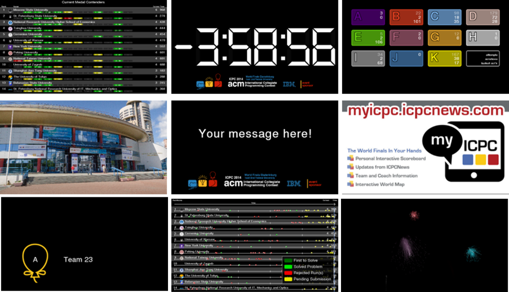

# The ICPC Presentation Client  


An ICPC Tool

## Introduction
The ICPC Presentation System provides a mechanism for generating "slide show" presentations containing
user-provided images, photos, and a variety of live data from a running contest.
The Presentation System consists of two components: _Presentation Clients_ and the _Presentation Admin_.
This document describes the Presentation Client component;
refer to the separate documentation on the Presentation Admin for an explanation of how that component operates.

A Presentation Client is a single process which displays (rotates between) one or more _presentations_.
The Presentation System contains a wide variety of built-in presentations, each of which is identified 
by having both a _number_ and a _title_ (also referred to as its _name_).
Each presentation client is started by giving it a list of the
presentations (by number or title) that the client should display. It is allowable to start multiple
simultaneous presentation clients, each displaying its own (possibly overlapping) set of presentations.
Each separate presentation client is typically run on a separate machine, with each machine connected 
to a projector or large display to allow many people to watch. (At the ICPC World Finals, for example,
as many as 10 or more separate screens are displayed, each running its own specified sequence of presentations.)

Some built-in presentations incorporate data from a running contest. For example, one presentation
knows how to display the current contest scoreboard, updating it as the contest progresses;
another displays a rising (animated) balloon, labeled with the appropriate team and problem letter/color,
whenever a team solves a problem; 
another presentation shows a graph of the languages used to solve problems so far in the contest; 
another shows the runs currently in the "judge's queue" and the judgment each runs receives
as it exits the queue;
still another presentation shows the current contest clock (remaining time); 
and so forth.

The following images show some of the many built-in presentations which can be displayed by the
Presentation System; see below for a complete list of available presentations.



## Input Data Sources

When a Presentation Client is started it must be told, in addition to what presentations to display,
where to obtain its input data (images, contest events, etc.).
This is referred to as specifying a _contest data source_.
Presentation Clients can obtain their input data from two different types of contest data sources:
a compliant [_Contest API_](https://ccs-specs.icpc.io/contest_api), or a
a [_contest data package (CDP)_](https://clics.ecs.baylor.edu/index.php/Main_Page#Contest_Data_Package).

When connecting to a live Contest Control System via the Contest API, the Presentation Client works
by reading the _event feed_ output of the CCS.
The ICPC Presentation System will work with any CCS or the CDS that produces an event feed which is 
compliant with the [Contest API Specification](https://ccs-specs.icpc.io/contest_api).
Tools known to produce compliant event feeds include
[Contest Data Server](https://tools.icpc.global/cds/), 
[DOMjudge](https://www.domjudge.org),
[PC-Squared](http://pc2.ecs.csus.edu/pc2), and 
[Kattis](https://www.kattis.com); 
other Contest Control Systems may also produce compatible event feeds and 
hence work with the Presentation System.

A second way to provide the Presentation Client with input data is by creating a _contest data package_ (CDP). 
A CDP is an arbitrarily-named folder with specific contest-configuration contents;
see the above reference for details on CDP structure.

## Using the Presentation Client

### Installation

To install the Presentation Client, download and unzip the Presentation Client 
distribution package to any convenient location. 
The Presentation Client itself is a collection of Java programs (components).
The distribution is a self-contained package which contains 
all the Java libraries and other components necessary to run the Presentation Client.
(Note however that Java itself, version 1.8 or higher, must be installed on the
machine.)

### Operation

The Presentation Client is designed to run in one of two modes: _standalone_ 
or _admin_controlled_. This document focuses on using the Presentation Client
in _standalone_ mode. Using the Presentation Client in _admin-controlled_ mode
requires installing the separate _Presentation Admin_ ICPC Tool; that usage
is discussed briefly below and is described in greater detail in the separate 
documentation for the Presentation Admin (a separate ICPC Tool).

#### Standalone Mode

The Presentation Client distribution includes a set of scripts which can be used to launch the program,
standalone.bat for Windows platforms and standalone.sh for macOS and Linux.
(for Linux or similar systems see _Additional Notes_, below)
Also, see the Presentation Admin documentation for information regarding a
second script, _client.bat_, which is contained in the Presentation Client
distribution.

The _standalone_ script assumes it is being run from the main 
Presentation Client folder (i.e., from the folder where the distribution was unzipped).
The script is intended to be invoked with a set of command line parameters, which 
control the operation of the program.

The first parameter to the script specifies a contest data source.
If the second parameter is the name of a folder,
the Presentation Client interprets it as the root of a _contest data package (CDP)_,
as described above, and it uses the specified CDP to obtain its contest data.

If the second parameter is a URL, the Presentation Client interprets it as
the URL of a Contest API server; it opens a connection to the specified
server and reads its input data. The Presentation Client expects the next two parameters to
specify a user name and password. This user name and password are used to login to 
the Contest API.

The next parameter must be the "--p" option followed by a set of presentation names or numbers, 
separated by spaces; for example, "2 4 clock" (which requests a presentation sequence
consisting of presentation number 2, then number 4, then the presentation named "clock").
 
To terminate a running presentation, press Ctrl-Q.

#### Admin-Control Mode

As described above, the Presentation Client provides support for displaying
(rotating between) one or more individual presentations. Each instance of the Presentation
Client is limited to this functionality; multiple instances can be started but
they have no knowledge of each other, there is no way to coordinate their
content other than manually when they are started, and there is no way to change
the content of a given Presentation Client except by shutting it down and restarting it.

The ICPC Tool set also includes a separate tool called the _Presentation Admin_
(see the [ICPCTools website](https://tools.icpc.global)). 
The Presentation Admin tool provides functionality
for managing multiple Presentation Clients; it allows dynamically changing the content
of each of many clients along with additional related functions.

If a Presentation Client is going to be used in conjunction with a Presentation Admin,
the Presentation Client must be started in a slightly different way. This is supported
by a second script (batch file) named _client.bat_.

Like the _standalone_ script, the _client_ script assumes it is being run from the main 
Presentation Client folder (i.e., from the folder where the Presentation *Client*
distribution was unzipped),
and the script is intended to be invoked with a set of command line parameters
which control the operation of the Presentation Client program.
In this case, however, the parameters
are used to tell the Presentation Client that it is to register itself with
a Presentation Admin and to await further instructions from the Admin.

The first parameter to the client script is a client-specific identifier
(typically a number) specifying the identity of the client being started
(this ID value is used to uniquely identify this particular Presentation Client
to the Presentation Admin). The second script parameter must be the URL of
a Contest Data Server to which the client should connect and from which it
will receive Admin commands (the Presentation Admin will connect to the
same CDS and issue commands to it which the CDS forwards to designated
Presentation Clients). The third and fourth parameters to the client.bat script
are the login user name and password for the CDS.


## Usage

The general form for executing the Presentation Client in standalone mode is

```
  standalone.bat/sh contestURL user password [options], or
  standalone.bat/sh contestPath [options]
```
where
```
  contestURL is an HTTPS URL to connect to a CDS, followed by user and password

  contestPath is a local file or folder to load from a contest data package archive

  [options] can be "--p" followed by a set of presentation names or numbers, or
                  "--display <num>", where <num> is which desktop display to use
                  in full-screen exclusive mode. The primary display is number 1,
                  secondary is number 2, etc. If this option is not specified
                  the default is the primary display.
```

The general form for executing the Presentation Client in admin-controlled mode is

```
  client.bat/sh CDSurl user password [options]
```
where
```
  CDSurl is an HTTPS CDS URL, followed by user and password
  
  [options] can be "--name" followed by a name used to refer to this client, or
                  "--display <num>", where <num> is which desktop display to use
                  in full-screen exclusive mode. The primary display is number 1,
                  secondary is number 2, etc. If this option is not specified
                  the default is the primary display.
```

## Examples

```
  standalone.bat https://cds user pwd --p logo pictures
```

The above command starts the Presentation Client, causes it to connect to a CDS at the specified
URL using the specified user name ("user") and password ("pwd"), and begins alternating between
two presentation displays: the first consisting of the ICPC Contest Logo, the second
consisting of a set of pictures obtained from the appropriate CDS URL.
  
```
  standalone.bat c:\myContestCDP --p 1 3 16
```

The above command starts the Presentation Client, causes it to load contest information
from the Contest Data Package whose root is the folder "c:\\myContestCDP", and begins
alternating between presentations 1, 3, and 16.

```
  client.sh https://contestDataServer user pwd --name "Site 2"
```

The above command starts a Presentation Client in admin-controlled mode, causing it
to connect to the CDS specified by the URL _https://contestDataServer_ logging in 
with the name "user" and the password "pwd" and registering itself with the Presentation
Admin as "Site 2". The Presentation Client then remains
quiescent with a blank screen until it receives a command from a Presentation Admin
(forwarded via the CDS) telling it what to display.

## Available Presentations

The Presentation System contains a variety of built-in presentations which can be
displayed by Presentation Clients.
(It is also possible for users to create their own presentations, both static
and dynamic, and to include them into the ICPC Presentation System; a future version 
of this document will provide information on how that works.)
Some of the available presentations are listed in the table below, which shows
their identifying number and name, the internal specification by which they are known,
and notes on their operation. (Note that the numbers will be different, and some
presentations are only useful when used in conjunction with the Presentation Admin.)

 | # | Name | Internal Id | Notes
 | ---: | --- | --- | ---
 | 1 | Bill Poucher | .bill | The venerable ICPC Executive Director.
 | 2 | Chart - Languages | .chart.language | 
 | 3 | Chart - Problem detail | .chart.problem.detail | 
 | 4 | Chart - Problem summary | .chart.problem.summary | Shows attempts, solutions, and fastest solution time for each problem.
 | 5 | Chart - Scoreboard | .chart.scoreboard | The current contest standings; scrolls through all teams and updates dynamically as new data arrives.
 | 6 | Chart - Total Problems | .chart.total.problems | 
 | 7 | Contest clock | .clock | The contest clock (time remaining in the contest).
 | 8 | Countdown | .countdown | A countdown clock, initialized by data in the contest event feed.
 | 9 | Do not touch anything | .doNotTouch | 
 | 10 | Fireworks | .fireworks | 
 | 11 | First solution | .first.solution | Tracking the first solution.
 | 12 | First to solve | .first.to.solve | First to solve each problem.
 | 13 | Judge queue | .judge | The judgement queue: shows all incoming runs and what the result is.
 | 14 | Leaderboard | .leaderboard | 
 | 15 | Logo | .logo | Displays the contest logo.
 | 16 | Message | .message | Displays a message and contest banner. The message is set via a property in the Presentation Admin.
 | 17 | Photo | .single.photo | Displays a single photo, taken from the CDP/present folder in file _photo.jpg_.
 | 18 | Pictures | .photos | Displays a rotating set of pictures found in the CDP/present/photos folder.
 | 19 | Problem summary | .problem.summary | 
 | 20 | Promotions | .promo | Displays a rotating set of promotional images.
 | 21 | Group leaderboard | .leaderboard.group | 
 | 22 | Scoreboard | .scoreboard | Contest scoreboard.
 | 23 | Team Display | .team.display | Display for team machines, shows the team logo and name. The team is is set via a property in the Presentation Admin.
 | 24 | Test - Alignment | .test.align | A grid to help with projector alignment.
 | 25 | Test - Clock | .test.clock | The current system time (on the presentation machine).
 | 26 | Test - Synchronization | .test.sync | A moving ball to test synchronization of the system clock.

## Team Clients

At some contests you may want to run a presentation client on every team machine. If you just want to display static or common
content like the contest logo you can do this with the standalone client, e.g.:

```
  standalone.bat https://contestSource user pwd --p logo
```

If you want to run more interesting presentations or control from the admin, use the admin-controlled client with the special id 'team':

```
  client.sh https://contestDataServer user pwd --name team
```

This will start a client that understands which team it is running on, and can display team-specific presentations. A good
example is the "team desktop" presentation, which shows the team's logo and name, contest logo, and contest time.

The client decides which team machine it is running on by checking the following sources:

 | Source | Example
 | --- | ---
 | team-id environment variable | 47
 | team-id system property (would require changing the script) | 47
 | end of host name | teamnum47
 | end of host address | 195.13.4.47

The first source that correctly resolves into a number is used. All of the examples above resolve to team id 47.

## Additional Notes

The Presentation System is written in Java and will run on any platform supporting Java Version 8 or greater.
However, it makes heavy use of screen-level graphics and is therefore heavily dependent on the
graphics drivers on the platform.
In our experience, Linux graphics drivers tend to be substantially less robust than others;
we have had much better success running the Presentation components
on Windows and Mac platforms.
Your mileage may vary (substantially).