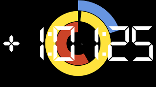
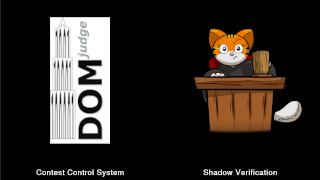
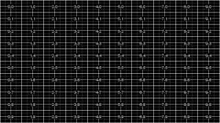
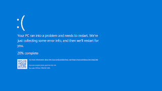

# The ICPC Presentation Client  

{width=50}

An ICPC Tool

## Introduction
The ICPC Presentation System provides a mechanism for generating "slide show" presentations containing
user-provided images, photos, and a variety of live data from a running contest.
The Presentation System consists of two components: _Presentation Clients_ and the _Presentation Admin_.
This document describes the Presentation Client component;
refer to the separate documentation on the Presentation Admin for an explanation of how that component operates.

A Presentation Client is a single process which displays (rotates between) one or more _presentations_.
The Presentation System contains a wide variety of built-in presentations, each of which is identified 
by having both a _number_ and a _title_ (also referred to as its _name_).
Each presentation client is started by giving it a list of the
presentations (by number or title) that the client should display. It is allowable to start multiple
simultaneous presentation clients, each displaying its own (possibly overlapping) set of presentations.
Each separate presentation client is typically run on a separate machine, with each machine connected 
to a projector or large display to allow many people to watch. (At the ICPC World Finals, for example,
as many as 10 or more separate screens are displayed, each running its own specified sequence of presentations.)

Some built-in presentations incorporate data from a running contest. For example, one presentation
knows how to display the current contest scoreboard, updating it as the contest progresses;
another displays a rising (animated) balloon, labeled with the appropriate team and problem letter/color,
whenever a team solves a problem; 
another presentation shows a graph of the languages used to solve problems so far in the contest; 
another shows the runs currently in the "judge's queue" and the judgment each runs receives
as it exits the queue;
still another presentation shows the current contest clock (remaining time); 
and so forth.

The following images show some of the many built-in presentations which can be displayed by the
Presentation System; see below for a complete list of available presentations.


## Input Data Sources

When a Presentation Client is started it must be told, in addition to what presentations to display,
where to obtain its input data (images, contest events, etc.).
This is referred to as specifying a _contest data source_.
Presentation Clients can obtain their input data from two different types of contest data sources:
a compliant [_Contest API_](https://ccs-specs.icpc.io/contest_api), or a
a [_contest data package (CDP)_](https://clics.ecs.baylor.edu/index.php/Main_Page#Contest_Data_Package).

When connecting to a live Contest Control System via the Contest API, the Presentation Client works
by reading the _event feed_ output of the CCS.
The ICPC Presentation System will work with any CCS or the CDS that produces an event feed which is 
compliant with the [Contest API Specification](https://ccs-specs.icpc.io/contest_api).
Tools known to produce compliant event feeds include
[Contest Data Server](https://tools.icpc.global/cds/), 
[DOMjudge](https://www.domjudge.org),
[PC-Squared](http://pc2.ecs.csus.edu/pc2), and 
[Kattis](https://www.kattis.com); 
other Contest Control Systems may also produce compatible event feeds and 
hence work with the Presentation System.

A second way to provide the Presentation Client with input data is by creating a _contest data package_ (CDP). 
A CDP is an arbitrarily-named folder with specific contest-configuration contents;
see the above reference for details on CDP structure.

## Using the Presentation Client

### Installation

To install the Presentation Client, download and unzip the Presentation Client 
distribution package to any convenient location. 
The Presentation Client itself is a collection of Java programs (components).
The distribution is a self-contained package which contains 
all the Java libraries and other components necessary to run the Presentation Client.
(Note however that Java itself, version 1.8 or higher, must be installed on the
machine.)

### Operation

The Presentation Client is designed to run in one of two modes: _standalone_ 
or _admin_controlled_. This document focuses on using the Presentation Client
in _standalone_ mode. Using the Presentation Client in _admin-controlled_ mode
requires installing the separate _Presentation Admin_ ICPC Tool; that usage
is discussed briefly below and is described in greater detail in the separate 
documentation for the Presentation Admin (a separate ICPC Tool).

#### Standalone Mode

The Presentation Client distribution includes a set of scripts which can be used to launch the program,
standalone.bat for Windows platforms and standalone.sh for macOS and Linux.
(for Linux or similar systems see _Additional Notes_, below)
Also, see the Presentation Admin documentation for information regarding a
second script, _client.bat_, which is contained in the Presentation Client
distribution.

The _standalone_ script assumes it is being run from the main 
Presentation Client folder (i.e. from the folder where the distribution was unzipped)
and is invoked with a set of command line parameters to control its operation.

The first parameter to the script specifies a contest data source, either a URL to a
Contest API server, or a local folder that is the root of a _contest data package (CDP)_
as described above.

If the first parameter is a URL, the Presentation Client expects the next two parameters to
specify a user name and password. This user name and password are used to login to 
the Contest API.

The final parameter must be a "--p" option followed by a set of presentation names or numbers, 
separated by spaces; for example, "2 4 clock" (which requests a presentation sequence
consisting of presentation number 2, then number 4, then the presentation named "clock").
 
To terminate a running presentation, press Ctrl-Q.

#### Admin-Control Mode

As described above, the Presentation Client provides support for displaying
(rotating between) one or more individual presentations. Each instance of the Presentation
Client is limited to this functionality; multiple instances can be started but
they have no knowledge of each other, there is no way to coordinate their
content other than manually when they are started, and there is no way to change
the content of a given Presentation Client except by shutting it down and restarting it.

The ICPC Tool set also includes a separate tool called the _Presentation Admin_
(see the [ICPCTools website](https://tools.icpc.global)). 
The Presentation Admin tool provides functionality
for managing multiple Presentation Clients; it allows dynamically changing the content
of each of many clients along with additional related functions.

If a Presentation Client is going to be used in conjunction with a Presentation Admin,
the Presentation Client must be started in a slightly different way. This is supported
by a second script (batch file) named _client.bat_.

Like the _standalone_ script, the _client_ script assumes it is being run from the main 
Presentation Client folder (i.e. from the folder where the Presentation *Client*
distribution was unzipped)
and is invoked with a set of command line parameters to control its operation.
In this case, however, the parameters are used to register with
a Contest Data Server (CDS) and await further instructions from an Admin.

Similar to the _standalone_ script, the first three parameters to the _client_ script
must be a URL to a CDS, a user name, and a password. You do not
use "--p" since the list of presentations to display will be configured using an Admin.

If you are running multiple presentation clients it is useful to be able to
differentiate them. The "--name" option can be used followed by a string
(e.g. "--name left-screen") to uniquely identify this particular client in
the Admin.


## Usage

The general form for executing the Presentation Client in standalone mode is

```
  standalone.bat/sh contestURL user password [options], or
  standalone.bat/sh contestPath [options]
```
where
```
  contestURL is an HTTPS URL to connect to a CDS, followed by user and password

  contestPath is a local file or folder to load from a contest data package archive
```

The general form for executing the Presentation Client in admin-controlled mode is

```
  client.bat/sh CDSurl user password [options]
```
where
```
  CDSurl is an HTTPS CDS URL, followed by user and password
  
```

#### Command Line Options

```
--p <presentations>
```
Standalone client only. Any number of parameters specifying the presentation(s) to display.
Each parameter must by a number or partial presentation name. For example, "2 4 clock" which
requests a presentation sequence consisting of presentation number 2, then number 4, then
the presentation named "clock". Run without any options to see the list of available
presentations.

```
--name <name>
```
Admin-controlled client only. Specifies a name to refer to this client in the admin, e.g.
"Stage right" or "Hallway".

```
--display <num>
```
Specifies which desktop display to use in full-screen exclusive mode. The primary display
is number 1, secondary is number 2, etc.  If this option is not specified
the default is the primary display.

```
--multiDisplay <p@wxh>
```
Specifies that this client is part of a presentation stretched across multiple client
displays. The format of the parameter is "position @ width x height", where width and
height are the number of displays horizontally and vertically, and position starts at
1 in the top left and is incremented horizontally. For example, use \"2@3x2\" to
indicate this client is position 2 (top middle) in a 3x2 grid.

```
--fps
```
Shows the frame rate on screen.

```
--display_name <template>
```
Allows you to change the way team names are displayed using a template with the following
parameters:

| Parameter | Value
| --- | --- |
| {team.display_name} | The team's display name, e.g. "drop tables". If there is no display name the team name will be used.
| {team.name} | The team's name, e.g. "drop tables".
| {org.name} | The organizations name, often a short form, e.g. "UBC".
| {org.formal_name} | The full organization name, e.g. "University of Toronto". If there is no formal name the organization name will be used.

Examples:
 - -—display_name "{team.name} ({org.name})"
 - -—display_name "{org.formal_name}"
 - -—display_name "{org.formal_name} ({team.name})"


## Examples

```
  standalone.bat https://cds user pwd --p logo pictures
```

The above command starts the Presentation Client, causes it to connect to a CDS at the specified
URL using the specified user name ("user") and password ("pwd"), and begins alternating between
two presentation displays: the first consisting of the ICPC Contest Logo, the second
consisting of a set of pictures obtained from the appropriate CDS URL.
  
```
  standalone.bat c:\myContestCDP --p 1 3 16
```

The above command starts the Presentation Client, causes it to load contest information
from the Contest Data Package whose root is the folder "c:\\myContestCDP", and begins
alternating between presentations 1, 3, and 16.

```
  client.sh https://contestDataServer user pwd --name "Site 2"
```

The above command starts a Presentation Client in admin-controlled mode, causing it
to connect to the CDS specified by the URL _https://contestDataServer_ logging in 
with the name "user" and the password "pwd" and registering itself with the Presentation
Admin as "Site 2". The Presentation Client then remains
quiescent with a blank screen until it receives a command from a Presentation Admin
(forwarded via the CDS) telling it what to display.

## Available Presentations

The Presentation System contains a variety of built-in presentations which can be
displayed by Presentation Clients.
(It is also possible for users to create their own presentations, both static
and dynamic, and to include them into the ICPC Presentation System; a future version 
of this document will provide information on how that works.)
Some of the available presentations are listed in the table below, which shows
their identifying number and name, the internal specification by which they are known,
and notes on their operation. (Note that the numbers will be different, and some
presentations are only useful when used in conjunction with the Presentation Admin.)

Available presentations:

|   # | Name                   | Id                        | Thumbnails | Description
| --: | ----                   | ----                      | ---- | ----
| | **Beta**
|  1 | Better Fireworks       | .better.fireworks         |  | 
|  2 | Contest Floor          | .floor                    |  | Shows the contest floor and all the teams competing
|  3 | Floor Activity         | .old.floor                |  | Displays the contest floor
| | **Chart**
|  4 | Historical comparison  | .chart.historical         |  | 
|  5 | Judge Queue Depth      | .chart.queue.depth        |  | 
|  6 | Judgement time         | .chart.judgement.time     |  | 
|  7 | Languages              | .chart.language           |  | 
|  8 | Problem comparison     | .chart.problem.comparison |  | 
|  9 | Problem detail         | .chart.problem.detail     |  | 
| 10 | Problem summary        | .chart.problem.summary    |  | Shows attempts, solutions, and fastest solution time for each problem.
| 11 | Scoreboard             | .chart.score              |  | Shows position of contest leaders through the contest.
| 12 | Total Problems         | .chart.total.problems     |  | 
| | **Clock**
| 13 | Contest clock          | .clock                    |  | The contest time remaining.
| 14 | Countdown              | .countdown                |  | A countdown clock for start and end of a contest.
| 15 | Polar countdown        | .polar                    |  | A polar countdown clock for start and end of a contest.
| | **Fun**
| 16 | Bill Poucher           | .bill                     |  | The venerable ICPC Executive Director.
| 17 | Do not touch anything  | .doNotTouch               |  | A pre-contest message from the ICPC World Finals Systems Director.
| 18 | Fireworks              | .fireworks                |  | 
| 19 | Mohamed Fouad          | .mohamed                  |  | 
| | **ICPC**
| 20 | Balloon Path           | .balloon.path             |  | Contest floor showing moving submissions and balloons
| 21 | Commentary             | .commentary               |  | Displays contest commentary.
| 22 | Fading Logos           | .org.logo.fade            |  | Shows the logos of all organizations by fading between them
| 23 | Logo Wall              | .org.logo.wall            |  | Shows all organization logos
| 24 | Photo and caption      | .single.photo             |  | The photo at CDP/present/photo.jpg and an optional message.
| 25 | Photos                 | .photos                   |  | A rotating set of photos found in CDP/present/photos/.
| 26 | Problem Colours        | .problems.colors          |  | The problem colors
| 27 | Problem summary        | .problem.summary          |  | 
| 28 | Single Team            | .team                     |  | A team photo and name.
| 29 | Sliding Logos          | .org.logo.slide           |  | Slides the logos of all organizations
| 30 | Staff                  | .staff                    |  | ICPC staff titles
| | **Logos and Messages**
| 31 | CCS                    | .ccs                      |  | The primary (and optional shadow) CCS images found in CDP/present/ccs/primary.png and shadow.png.
| 32 | ICPC Tools             | .icpc.tools               |  | The ICPC Tools logo
| 33 | Image progression      | .imagebuild               |  | Fades through a set of images in progression (CDP/present/path*).
| 34 | Logo A                 | .logo                     |  | Displays the contest logo (CDP/present/logoA*.png).
| 35 | Logo B                 | .logo2                    |  | Displays the contest logo (CDP/present/logoB*.png).
| 36 | Message                | .message                  |  | A message and contest banner.
| 37 | Promotions             | .promo                    |  | A rotating set of promotional images found in CDP/present/promo/.
| | **Maps**
| 38 | Group                  | .map.group                |  | Shows where groups are from on a map.
| 39 | Submissions            | .map.balloon              |  | A world map with team submissions coming from their location
| 40 | Team Intro             | .map.team                 |  | Steps through all teams on a map.
| 41 | World                  | .map.world                |  | Map of the world.
| | **Scoreboard**
| 42 | All Groups leaderboard | .leaderboard.group.all    |  | 
| 43 | First solution         | .first.solution           |  | Tracks the first solution in the contest.
| 44 | First to solve         | .first.to.solve           |  | Shows which team was the first to solve each problem.
| 45 | Group leaderboard      | .leaderboard.group        |  | 
| 46 | Judge queue            | .judge                    |  | The judgement queue. Shows all incoming submissions and the judgement.
| 47 | Leaderboard            | .leaderboard              |  | 
| 48 | Scoreboard             | .scoreboard               |  | The current contest standings.
| 49 | Team Judgements        | .judge.team               |  | A team judgement queue. Shows all incoming submissions and the judgement.
| 50 | Timeline               | .scoreboard.timeline      |  | 
| | **Team**
| 51 | Desktop                | .icpc.team                |  | Team machine desktop display. Shows the team logo and name.
| 52 | Logo                   | .icpc.logo                |  | The ICPC identifier.
| 53 | Snake                  | .icpc.team.snake          |  | Wave based on team labels
| 54 | Sync                   | .icpc.sync                |  | Flashing ICPC in sync.
| 55 | Video test             | .icpc.team.video          |  | A tool to verify video.
| 56 | Wave                   | .icpc.team.wave           |  | Do the wave!
| | **Test**
| 57 | Alignment              | .test.align               |  | A grid to help with projector alignment.
| 58 | BSoD                   | .test.bsod                |  | A special hello from the other Bill
| 59 | Chart                  | .test.chart               |  | A test chart
| 60 | Clock                  | .test.clock               |  | The current system time on the presentation machine.
| 61 | FPS                    | .test.fps                 |  | A frame rate guage
| 62 | Synchronization        | .test.sync                |  | A moving ball to test synchronization of the system clock.
| | **Tile Scoreboards**
| 63 | Team scoreboard        | .tile.team                |  | Team picture with overlayed scoreboard tile
| 64 | Tile list              | .tile.scoreboard.list     |  | A contest scoreboard listed alphabetically by team
| 65 | Tile rank              | .tile.scoreboard.rank     |  | A ranked contest scoreboard
| 66 | Tiles                  | .tile.scoreboard          |  | The current contest standings.
