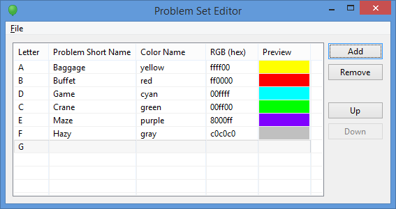

# The ICPC Problem Set Editor 

An ICPC Tool

## Introduction

The ICPC Problem Set Editor is a tool for creating and editing _problemset.yaml_ files, 
which define the list of contest problems
and their colors for a [CLICS-compliant](https://clics.ecs.baylor.edu/index.php/Contest_Control_System)
Contest Control System (CCS).

The following shows a screen shot of the editor in action:

## Using the Editor

### Installation

To install the editor, download and unzip the distribution package 
from the [ICPCTools website](https://icpc.baylor.edu/icpctools) to any 
convenient location. The editor is a self-contained Java application and
only requires a Java 1.8 JDK to run.

### Execution

The distribution includes two scripts which can be used to launch the program:
problemSet.bat (for Windows) and problemSet.sh (for macOS and Linux).
To start the editor, open a terminal window (command shell), 
change to the folder where you unzipped the distribution, and type the name of the
appropriate script. The scripts take one optional parameter: the name or path of
a problemset.yaml to edit. Executing the script with a single parameter "--help"
will produce a help (usage) message.

## Operating the Editor

TO-DO