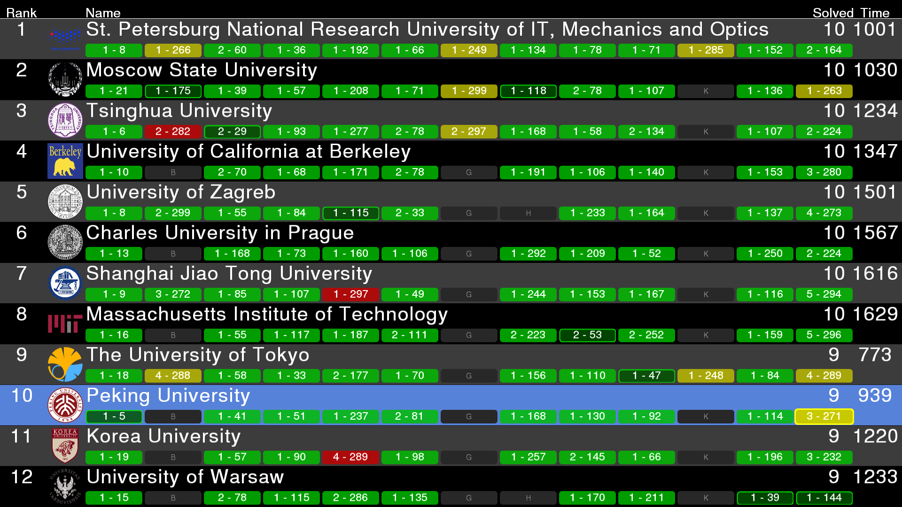
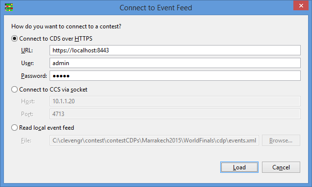
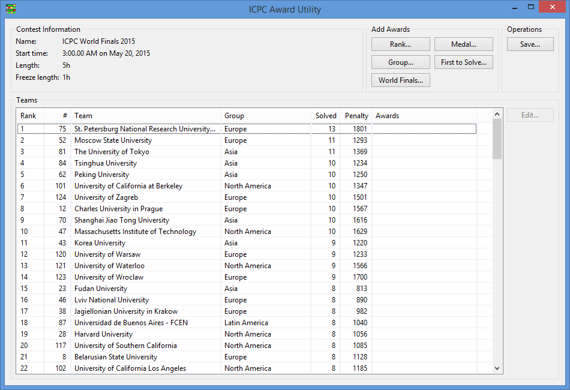
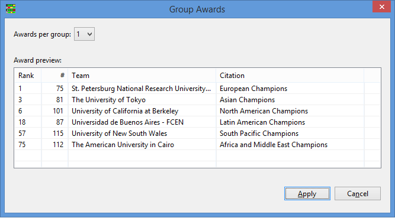
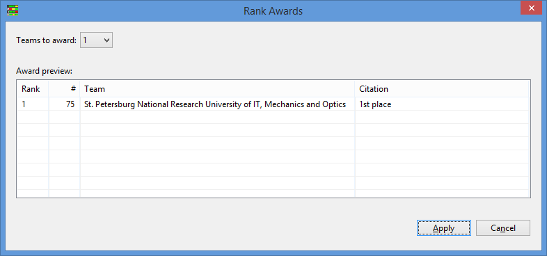
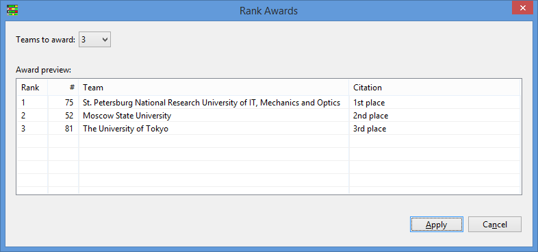
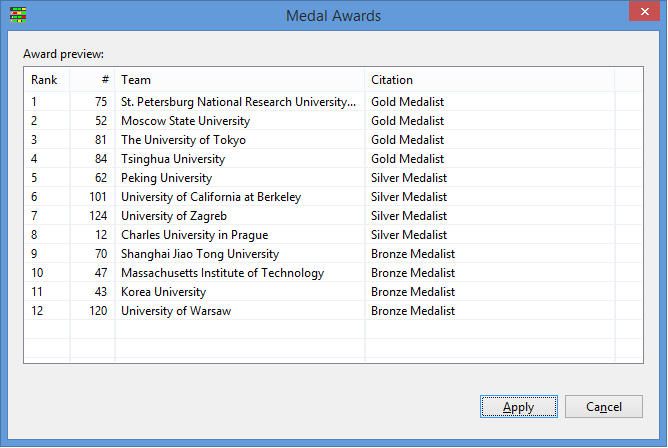
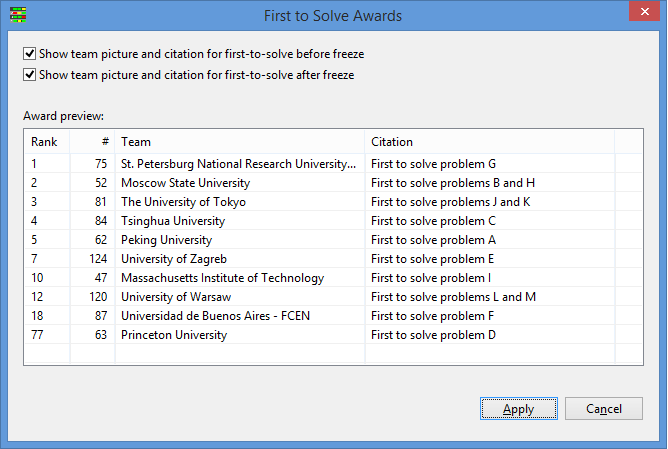
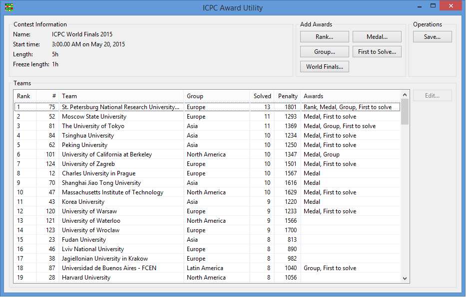
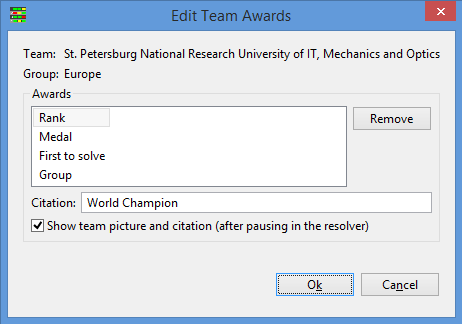

# The ICPC Resolver 

{width=50}

An ICPC Tool

## Introduction

The _ICPC Resolver_ is a tool for graphical animation of contest results. 
It shows the final runs submitted during a contest in an
interesting way, and leads up to display of the award winners. 
The Resolver concept was created by Fredrik Niemela and Mattias de Zalenski 
at KTH Royal Technical University.
The ICPC Tools Resolver implementation was developed by Tim deBoer.

The Resolver is designed to be used in contests where the scoreboard is "frozen"
prior to the end of the contest - that is, where the result of runs submitted in the
last part of the contest are not displayed on the scoreboard
(such runs are typically marked as "pending").
The Resolver produces a dynamic display by stepping through ("resolving") pending runs
and generating displays showing the contest winners in ranked order,
along with citations for awards earned.

After displaying an introductory "splash screen",
a single keystroke or mouse click causes the Resolver
to display the contest standings as of the time the scoreboard was frozen.
A key or mouse click then causes it to advance to the bottom of the standings;
a subsequent key/click starts the "resolving" process:
starting at the bottom, it moves up until it reaches a team that has one or more
pending submissions during the freeze time.
Each pending run is 'resolved' (to either a "yes" or "no" judgment),
and if the run was successful the team
will move 'up' into their new position based on the results.

Options allow you to configure when the resolver pauses, but by default it will
continue moving up and resolving until it gets to an 'interesting' case -
typically a first-to-solve award, a "group" or "region" winner,
or a gold/silver/bronze award winner. When it reaches an award, the resolver will pause
and switch to a screen showing the team name,
the logo and image (if available from a CDS; see below), and an award citation.
Once the award has been handed out, clicking returns to the regular Resolver
screen and continues the resolving process.

A variety of options are available, including managing the speed at which the
Resolver runs, controlling various "single-step" operations,
configuring categories of awards to be acknowledged during the resolving
process, and controlling simultaneous Resolver operations at multiple contest sites.

The following shows a screen-shot of the Resolver in action. Pending (unresolved) runs
are shown in yellow; the team whose pending run is about to be "resolved" is highlighted.
If it is a "Yes" then the team's entire row will move dynamically up the screen to
their new position.



### Operational Modes

The Resolver runs in one of two basic modes: _standalone_ or _distributed_.
In standalone mode, the Resolver is run on a single machine and displays its output
on that machine's display screen.
Typically a projector is connected to the graphics output port of the machine,
allowing the audience to see the Resolver display as it reveals the results of the contest.
The person running the standalone Resolver uses keyboard/mouse input to control the flow of
the Resolver (for example, to advance to the "next run to be resolved" or to display
"award results").
Standalone mode is typically used for example to display the results at the end of a
contest held at a single site.

In distributed mode, the Resolver is run on several machines.
One machine (the _presenter_ client) acts as the controller for the flow of events
(the Contest Administrator uses keyboard/mouse input to control Resolver operation,
similar to stand-alone mode).
A second machine runs a CDS server; and one or more additional machines act as _viewer_ clients.
The server is started first and listens for connections from clients;
presenter and viewer clients connect to the server over HTTPS.

Distributed mode is typically used in contests where teams are competing at different
(physically remote) sites,
or where the Contest Administrator wishes to see a different view of the resolving
process than what is displayed to local and/or remote audiences.
In distributed mode the Contest Administrator runs a presenter client and
controls the flow of the Resolver, while one or more viewer clients show the current Resolver
status screen. The presenter client has the option of displaying additional
useful information to the person controlling the Resolver (for example, when a pending run
is selected it can show a small dialog saying something like
"if the team solves this run then they will jump up into 3rd place").
This extra information display is only visible on the presenter client;
the viewer clients see only the main Resolver output.

Based on the access roles provided by the CDS and Contest API, the resolver requires the
presenter client to have the admin role and each of the clients to have the blue access role.
All of the clients work by downloading the final contest results, internally 'rewinding' to the contest
freeze, and then determining the sequence of steps to get from the freeze to the final contest.
The presenter client then sends out a step count to drive the UI of all clients.
Due to the requirement of blue access privileges it is expected that the resolver client
credentials are only given to trusted contest staff or not distributed until the last minute.

### Input Data Sources

The Resolver works with any CCS or the CDS that produces an event feed which is
compliant with the [Contest API Specification](https://ccs-specs.icpc.io/contest_api).
Tools known to produce compliant event feeds include
[Contest Data Server](https://tools.icpc.global/cds/), 
[DOMjudge](https://www.domjudge.org),
[PC-Squared](http://pc2.ecs.csus.edu/pc2), and 
[Kattis](https://www.kattis.com);
other Contest Control Systems may also produce compatible event feeds and
hence work with the Resolver.

The Resolver is capable of operating with event feed data obtained from one of
three different sources: an _event feed file_, a _contest data package_ (CDP folder),
or a _Contest API source_.

A CDP is an arbitrarily-named folder with specific contest-configuration contents.
If the Resolver is started with its first argument being the path (relative or absolute)
to a folder whose contents are organized following the
[CLI Contest Data Package specification](https://clics.ecs.baylor.edu/index.php/CDP) it will read its
event feed data from that folder
Note: when reading from a CDP the Resolver expects the find the event feed information stored in
a file named _events.json_ located in the CDP root folder.

Alternatively, the Resolver can obtain its event feed data from a Contest API server, for example
the Contest Data Server (CDS).
The Contest API provides URL access points for obtaining event feed and other contest data;
starting the Resolver with the URL of a Contest API causes it to connect to the Contest API
and pull down the necessary information dynamically.

The main reason for using either a CDP or a CDS instead of a simple event feed file to provide
Resolver input is that a CDP or CDS can also provide other information to the Resolver.
For example, if the CDP or CDS has been configured with
team pictures and/or team school/university logos, the Resolver knows how to pull these
from the corresponding input location as well and will use them in the output display. The sample image
(above) shows the use of such university logos; these came from starting the Resolver
by pointing it to a CDP
(but could have just as easily been generated by starting the Resolver and having
it connect to a CDS).

Note: The Resolver requires the input event feed to be "_finalized_". "Finalizing" is an
operation performed in the CCS which generates the event feed, indicating that the contest
has ended and the event feed contains the "complete (final) results".

### Using the Resolver

#### Installation

To install the Resolver, download its distribution package from the
[ICPCTools website](https://tools.icpc.global) and unzip it to any
convenient location.
The Resolver itself is a collection of Java programs (components).
The distribution is a self-contained package which contains
all the Java libraries and other components necessary to run the Resolver.
(Note however, that Java Version 1.8 or higher must be installed on the machine.)

#### Operation

The Resolver distribution includes a set of scripts which can be used to launch the program,
resolver.bat for Windows platforms and resolver.sh for macOS and Linux.
(for Linux or similar systems see _Additional Notes_, below)
The _resolver_ script assumes it is being run from the main Resolver folder 
(i.e., from the folder where the distribution was unzipped).
The script is intended to be invoked with a set of command line parameters,
which it forwards to the actual Resolver program and which in turn
control the operation of the Resolver.

The first parameter is a contest source. It may be an event feed
file, a contest data package folder, or a contest URL to a Contest API server. If the parameter is a contest URL,
then the following two parameters may optionally (and should) be a user and password.

Command line parameters other than the contest source must
start with the characters "--" (two dashes).
Each of the available command line parameters is described below.
Some command line parameters
require or allow additional arguments; optional arguments are
shown in square brackets ([ ]).

Note that some command line parameters are mutually exclusive.

#### Command Line Options

##### Distributed Mode Commands
The following command line options are used to operate the Resolver in "distributed mode", 
where it connects to a Contest Data Server (see above) to obtain its input data and also uses
the CDS to control multiple clients.
Note that these options are only available though the Contest Data Server and not when using
a generic Contest API Server.
Note also that  "--presenter" and "--client" are mutually exclusive.

```
--presenter
```
Starts a Resolver in "presenter" mode. A Resolver running
in presenter mode has control over the Resolver operation, and its control commands are
forwarded to the server for distribution to viewer clients. The user running the presenter
must have the admin role.

```
--client
```
Starts a Resolver in "viewer" mode, instructing it to connect to a server at the specified
URL. A Resolver running
in viewer mode updates itself based on commands received via the server from a presenter, but has
no control over the resolving process (for example, cannot "click to continue"). The user used to
start the client must have the blue access role.

##### Control Commands
The following command line options control various aspects of the Resolver's operation; they may be used in
either "stand-alone" or "distributed" mode. Note however that 
when running in distributed mode most options only make sense
for a presenter (for example, only the presenter should 
specify _--fast_ to control the speed of the Resolver;
otherwise viewer clients will operate
at a different speed than that of the presenter). 

```
--info
```
Shows additional information regarding each pending run.  
         
```
--fast <speedFactor>
```
Changes the resolving speed.
The [speedFactor] option is a decimal percentage indicating the desired amount of change
in the execution time for each step.  Factors between 0 and 1 speed up the resolving process;
factors greater than 1 slow it down.  For example a speedFactor of 0.5 will double the
speed (i.e., cut the time in half).  If --fast is specified but no speedFactor is given,
the default speedFactor is 0.15.

```
--singleStep <startRow>
```
Forces the Resolver to begin "single-stepping" (that is, requiring a key/mouse click to
advance on each step of the resolving process) starting at the specified row in the standings.
(For example, specifying a startRow of 10 causes single-stepping for the top 10 places in
the contest.)  If [startRow] is omitted then the Resolver single-steps through the entire contest.

```
--rowDisplayOffset <numRows>
```
Normally, medalist display rows on the Resolver screen appear at the bottom of the screen.
This option allows forcing the medalist display rows to begin appearing higher on the screen
by some number of rows.
It is used for example in the ICPC World Finals when Medalists come on stage to receive
their award and remain there for the rest of the Award Ceremony; the people standing on
stage can block the audience view of the bottom of the screen (and hence the next teams being
processed by the Resolver).  Specifying this option allows moving the medalist display
rows up the screen above the heads of the people standing on stage.  The default value for
[numRows] if it is not specified on the command option is 4.

```
--file <file>
```
Allows loading command options from the specified <file> instead of passing them on the
command line.  When using this option, every command option and every optional parameter
must appear on a separate line in the file.

```
--display <num>
```
Specifies which desktop display to use in full-screen exclusive mode. The primary display
is number 1, secondary is number 2, etc.  If this option is not specified
the default is the primary display.

```
--display_name <template>
```
Allows you to change the way team names are displayed using a template with the following
parameters:

| Parameter | Value
| --- | --- |
| {team.display_name} | The team's display name, e.g. "drop tables". If there is no display name the team name will be used.
| {team.name} | The team's name, e.g. "drop tables".
| {org.name} | The organizations name, often a short form, e.g. "UBC".
| {org.formal_name} | The full organization name, e.g. "University of Toronto". If there is no formal name the organization name will be used.

Examples:
 - -—display_name "{team.name} ({org.name})"
 - -—display_name "{org.formal_name}"
 - -—display_name "{org.formal_name} ({team.name})"
 
```
--test
```
Allows the resolver to be run against an incomplete contest. Unjudged submissions are
automatically discarded before resolving.

```
--pause <#>
```
Starts the resolver at the specified "pause" (i.e. click). Useful for testing or jumping
to review the medalists without restarting from the beginning.

```
--light
```
Light mode - use a white background and shift colors to match.

```
--help
```
Displays a help message listing the available options


##### Keyboard Shortcuts

Once the resolver is running, there are a number of commands that can be used to change behavior.

```
Ctrl-Q
```
Quit/exit the resolver (Ctrl-_Escape_ also exits).

```
space or f
```
Go forward one resolution step.

```
r or b
```
Rewind (back up) one resolution step.

```
0
```
Restart (jump to beginning).

```
2
```
Fast forward (jump one step without delays).

```
1
```
Fast rewind (jump one step without delays).

```
+ (or =)
```
Changes the resolving speed by increasing resolution delay (speedFactor).

```
- (or _)
```
Changes the resolving speed by decreasing resolution delay (speedFactor).

```
i
```
Toggle additional information regarding each pending run (same as --info).


### Command Line Examples

```
resolver.bat https://169.254.80.194:8443 admin adm1n --presenter --fast 0.7
  --rowDisplayOffset 4 --info
```
The above command runs the Resolver in presenter mode, connected to a CDS at the specified URL 
(IP address and port)
using the specified server login and password credentials, and runs reducing time by 30% (--fast 0.7).
Additional "presenter info" is displayed on the screen.

```
resolver.bat https://169.254.80.194:8443 client cl1ent --connect
```
The above command runs the Resolver in "client" mode, connecting to a CDS
at the specified URL using the specified server login and password credentials.
The client resolver operates under the control of a presenter-mode resolver
at the same speed as the presenter and displaying only the Resolver data
(no special info).

```
resolver.bat c:\events.json --singleStep 
```
The above command runs the Resolver in "stand-alone" mode, taking its input from the specified local
file.  It runs in single-step mode for the entire resolving process (meaning the user must click to
advance each and every step of the resolving process).

```
resolver.bat c:\contest\cdp  
```
The above command runs the Resolver in "stand-alone" mode, taking its input from the specified
contest data package folder.  It expects the event feed data to be in a file named "contest.xml"
in the specified CDP folder (c:\\contest\\cdp).
It displays award screens for region (group)
winners and for medals according to whatever "medal count" data is
contained in the event feed, and also displays an award screen for any team whose only award
was being the first to solve a problem after the scoreboard freeze.
It includes whatever additional data it can find in the CDP (for example, team pictures and/or
logos) in the output displays.

```
resolver.bat --help
```
The above command causes the Resolver to display its command parameter options on the console.

### Awards

In addition to stepping bottom-up through the contest scoreboard resolving pending runs and
dynamically adjusting teams' positions on the scoreboard, the Resolver
can be configured to display various types of _awards_.  When a team's final position in the
contest has been determined (meaning, the team has no more pending runs and has risen as
far in the rankings as they can go), then if the team is eligible for one or more enabled
awards then on the next key/mouse 'click' the Resolver will pause and switch to an "Award Screen".
The contents of the Award Screen depend on both the current Resolver award configuration and on the data available
to the Resolver (for example, whether it is connected to a CDS providing additional data such as
team pictures).

Note that awards are not displayed until a team has reached its final (highest possible) position.
The Resolver keeps track of all the awards a team earns and then when the team reaches their final
position in the standings, then if it has been configured to display at least one of the awards earned
by that team then it switches to a separate "Award screen" showing the team and listing _all_ of the 
configured awards earned by the team.  

#### Default Award Configuration

By default the Resolver is configured to display awards the way they are specified for the ICPC World Finals.
This section describes the World Finals awards, in order to clarify the default Resolver award configuration.
(See the following section for information on how to _change_ the Resolver's default award configuration
if your contest awards do not match those of the default configuration.)

At the World Finals, the top 12 teams receive "medal awards":  
the top four teams receive Gold Medals, the next four teams receive Silver Medals,
and the next group of teams receive Bronze Medals (typically the size of the Bronze Medal cohort is also four,
but this can vary depending on the final outcome; sometimes the Judges elect to award additional Bronze Medals to
teams beyond the top 12).  By default the Resolver is configured to display these same medal awards.

In addition, awards are presented at the World Finals to the highest placing team in each region of the world.
Note: while the term "region" makes sense when considering geographic boundaries such as those in the ICPC World Finals, 
in many contests teams are grouped by different categories such as academic level (e.g. "High School", "Undergraduate",
"Graduate", etc.) Because of this, many of the ICPC Tools
(including the Resolver and the Award Generator -- see below) use the term "group"
interchangeably with the term "region" to refer to a unique subset of the teams competing in a given contest.

The specification of what groups exist in a contest comes from the event feed 
(so, ultimately it comes from the CCS which generated the event feed).
The CCS used in the World Finals is configured to define six "regions" (groups):
North America, Latin American (comprising Central and South America),
Europe, Asia, Africa and the Middle East, and the South Pacific.  
(See the interactive [ICPC Regional Finder map](https://icpc.baylor.edu/regionals/finder) for definitions of the
precise boundaries of ICPC Regions.)
The highest placing team at the World Finals from each of the six ICPC regions
receives an award acknowledging their accomplishment as "Regional Champion".
The Resolver by default displays an award for the
top team in each group defined in its event feed.

Awards are also presented at the World Finals to each team that is the first to solve each problem in the contest.
These "First-to-Solve (FTS)" awards occur in two categories:  those for solutions which came prior to the time the
scoreboard was frozen (and hence are by definition already known to the spectators prior to the time the Resolver
begins), and those which occurred after the scoreboard was frozen (and hence are not known
by spectators until the Resolver reaches the pending run for that solution).
At the World Finals, the FTS awards for solutions which occurred prior to the scoreboard freeze are handed out
separately prior to beginning the Resolver execution; only FTS awards for problems solved after the scoreboard
freeze are treated as awards during the execution of the Resolver.

Taken together, the above means that by default the Resolver will automatically pause and then switch to an Award screen
when a team reaches their highest final position in the contest if the team has earned any Medal (of which there are
four Gold, four Silver, and four or more Bronze), if the team is the top team in their region/group (based on whatever
groups are defined in the event feed),
and/or if the team has earned a First-to-Solve award (if the FTS occurred after the scoreboard was frozen). All of the awards which the
team has earned will be listed on the Award screen, along with the team's name, school, and picture if that data
has been made available by connecting the Resolver to a CDS.

#### Custom Award Configuration

The award structure of a given contest may be different than the default arrangement described above.
In order to support this, the Resolver allows _customizable_ award categories.
Customizing the award categories requires executing an _award pre-processor_ step prior to running the Resolver.
The award preprocessor (also called the _Award Generator (AG)_)
reads the event feed which was going to be input to the Resolver and produces a new _augmented event feed_
containing additional award configuration information.  When the Resolver is executed using an augmented event feed
it recognizes the additional award configuration information
and uses it to control its behavior with regard to displaying awards.

The AG is invoked by executing a script, either _awards.bat_ on a Windows machine or _awards.sh_
on a Linux or macOS machine.  The script is located in the root folder of the unzipped Resolver distribution,
in the same place as the _resolver.bat_ script used to start the Resolver itself.  Specification of the custom
award configuration can be done in one of two ways: by passing command line options to the _awards_ script, or by
invoking a separate graphical user interface (GUI) that allows interactive award configuration.

##### Command Line Award Configuration 

The _awards_ script (this refers to both the Windows ".bat" version and the Bourne Shell ".sh" version) accepts a
variety of arguments and options for generating an augmented event feed used to control the awards to be displayed by the Resolver.
The general form of the command to invoke the awards script is

```
awards
```
or

```
awards events.json options...
```
Omitting all arguments (as shown in the first example) causes the script to invoke the interactive Award Generator interface (see below).

If arguments are specified, then the first argument must be the name of a file
containing an event feed. The AG reads the specified event feed file and
generates a new augmented event feed file containing awards as specified by the remaining "option" arguments.
Failing to specify any options (that is, specifying just an event feed file name) is an error and causes the AG to
generate a help (usage) message and quit.

When using the command line award configuration method,
the augmented event feed file is automatically saved in a new file whose name is the same as the
specified _events.json_ file but with "-awards" added in front of the ".json" extension.
(That is, the AG strips off the last five characters of the specified file name, assumed to be ".json",
and replaces them with the characters "-awards.json".)  


###### Command Line Options

The following options can be added to the _awards_ script command line following the event feed file name.
Note that all options start with the characters "--" (two hyphens), and that at least one option (with its arguments)
must be specified.

```
--medals <lastGold> <lastSilver> <lastBronze>
```
The above option specifies the last integer rank (position) in the contest which will be awarded Gold, Silver, and Bronze medals
respectively.  For example, the option "*_--medals 2 4 7_*" indicates that First and Second places will receive Gold medals,
Third and Fourth places will receive Silver medals, and Fifth through Seventh places will receive Bronze medals.

Note that a "finalized" event feed from a CCS by default contains "medalist places" as defined by the CCS which generated the event feed.
However, running the AG on such an event feed _overrides_ those medal places, replacing them with whatever medals are specified
via a *--medals* option.
In particular, note that this means that running the AG without specifying _any_ *--medals* option
results in an output event feed with NO medals awarded.

```
--rank <number>
```
The above option indicates that awards should be generated for teams in the top <number> ranks (positions) 
in the contest. For example, "*_--rank 10_*" will cause the top 10 teams to be designated to receive a "rank award".

```
--group <num>
```
The above option indicates that awards should be generated for the top number of teams in each group in the contest (where "groups"
are defined in the input event feed file as configured in the CCS which generated the file).
In the current version of the command line AG tool it is only possible to specify Group awards for the _top_ team in each group
(which is what specifying the "*_--group_*" option does).  For information on changing the number of awards _within_ a group,
see the interactive award configuration tool, described below.

```
--firstPlaceCitation "text"
```
The above option specifies the "citation text" which appears on the Award screen for the 1st place team, replacing 
the default first-place citation (which is "World Champions") with the specified text.  If the citation text contains
spaces then it must be surrounded with double-quotes.
In the current version of the command line AG tool it is only possible to change the citation for the 1st place team
(see the interactive award configuration tool, described below).

```
--fts  beforeFreezeBoolean afterFreezeBoolean
```
The above option indicates whether First-to-Solve awards should be generated for solutions which came before and
after the scoreboard was frozen.  To specify that an award category should be generated, enter the word "true" in place of
either _beforeFreezeBoolean_ or _afterFreezeBoolean_; to specify that the corresponding award should NOT be generated,
enter the word "false".  The words "true" and "false" are not case-sensitive.

```
--scoreboard filename
```
Generates a JSON scoreboard to the named file.


##### Interactive Award Configuration

If the _awards_ script is invoked with _no_ parameters, it causes the following dialog to be displayed:



This screen is used to instruct the Award Generator regarding the source of the event feed for the contest for which it
is to generate awards. The interactive Award Generator is capable of operating with event feed data obtained from one of
three different sources: a local event feed file, a socket connection directly
to an active CCS, or an HTTPS connection to a Contest Data Server.

Note that there is no difference (from the AG's point of view) whether it gets its event feed from
a local file, a CCS socket, or a CDS.  Specifically, the interactive AG tool does not use any other data from the source 
(for example, it does not attempt to pull anything other than the event feed from a CDS).

Selecting the desired option and pressing the "Load" button 
will load the selected event feed data into the AG and then display the 
Award Generator main screen, as shown below:



In the above screen the Award Generator has been loaded with the finalized 
event feed from the 2015 ICPC World Finals.
The grid shows each team's final rank, team number, team name, group (ICPC "Region"),
the number of problems solved, and the total "penalty points" (time).  Note that the
"Awards" column is empty; the Award Generator starts off with no Awards configured.

The buttons in the _Add Awards_ panel (upper right) are used to specify how awards are to be
configured for different categories in the contest.  Examples of configuring different categories
are described below.

###### Group Awards

Pressing the _Group..._ button pops up the following dialog for
managing Group awards:



By default there is just one award per group (for example, there is a single "Regional Champion"
in ICPC World Finals terminology); this is shown in the above image where there is one 
"award winner" in each of the (six) Regions (groups) defined in the contest event feed. Pressing
the _Apply_ button instructs the AG to use the specified Group Award configuration.

If, prior to pressing _Apply_, the _Awards per group_ dropdown (shown in the upper left in the
above image) is used to specify (say) two awards per group, then the top _two_ teams in each
group would be configured to receive a group award for their group. (The "citation" associated with groups
cannot be changed on the Group Awards dialog; however, see below regarding editing team awards.)

Note: the specification of what groups exist in the contest is not configurable in the Award Generator;
this specification comes from the event feed generated by the CCS. If different groups are
desired then they must be configured in the CCS before it creates the event feed.

###### Rank Awards

Pressing the _Rank..._ button on the _Add Awards_ panel
pops up a _Rank Awards_ dialog intended to configure how awards are handled for ranks (final position in 
the contest), as shown below:



Note that by default only a single "Rank" award (1st Place) is specified.
If the _Teams to award_ dropdown (upper left) is used to specify (say) three teams, then the
top _three_ teams in the contest would be configured to receive Rank awards,
as shown in the following image.



Pressing the _Apply_ button on the Rank Awards dialog configures the AG to generate the specified
rank awards.

###### Medal Awards

Pressing _Medal..._ on the _Add Awards_ panel pops up the following dialog for configuring
Medal awards:



As shown, the top twelve ranks in the contest are configured to receive medals: four gold,
four silver, and four bronze.  The medal counts came from the input event feed (meaning, they
came from the CCS) and cannot be changed in the current version of the interactive AG (although
they can be changed using a command line option as described earlier).  A future version of the AG
will support interactive modification of the medal counts.

As with the other _Add Awards_ dialogs, pressing _Apply_ instructs the AG to configure the specified
medal awards.

###### First-to-Solve Awards

Pressing _First to Solve_ on the _Add Awards_ panel displays the following dialog for configuring
FTS awards:



As with some of the other Award configuration dialogs, the current version of the AG does not 
support changing the FTS configuration.  The FTS dialog does however allow using the checkboxes 
in the upper left to control whether or not the team's picture and the specified citation appears
on configured FTS awards.

As with the other dialogs, pressing _Apply_ instructs the AG to configure the specified FTS awards.

###### Summary

The following image shows the Award Generator main screen after Rank, Medal, Group, and FTS awards have been configured:



Note that the team data (ranks, names, groups, etc.) is the same as in the first AG main screen image shown
earlier, but now the "Awards" column has been filled in.  The values in this column indicate what Awards
will be displayed by the Resolver.  

###### World Finals Awards

The remaining button on the _Add Awards_ panel, _World Finals..._, is a convenience shortcut
for configuring the AG to use the default World Finals awards.  Pressing _World Finals..._
displays a listing of exactly what awards would be given in the current contest if awards
were configured exactly as is done in the World Finals;
hitting _Apply_ then applies those awards in the AG.  

Note that applying the World Finals
award configuration in the AG produces an augmented event feed that would be handled in exactly the same way
by the Resolver as if the AG had not been used (since hitting _Apply_ on the _World Finals..._ panel configures
awards using the same values as the default values in the Resolver).  The World Finals configuration
option exists as a convenience in anticipation of providing a different default award configuration in future versions
of the Resolver.

##### Editing Awards

Once the desired award categories have been configured in the AG, it is possible to modify the
awards to be issued to any particular team. This is useful, for example, to circumvent the problem
that if multiple Group awards are configured for each group (region),
the citations for all Group awards in the group (region) will be identical (each team will be
listed as "Group Champion"). 

To modify a team's award, select the team's row
in the AG main screen grid and click the _Edit_ button to the right of the grid.
This produces an Edit dialog similar to the following:



This dialog displays all the awards currently configured for the selected team, along with the
corresponding "citations" which will appear
on their award display (one citation for each different award category).
Any desired award citation can be edited by first selecting the award category 
(for example, Rank, Group, Medal, or First To Solve) and
then typing the desired citation in the "Citation" textbox.
Awards can be removed from the award display by 
selecting the award and pressing the "Remove" button.

The checkbox on the Edit Team Awards dialog is used to tell
the Resolver whether or not it should show the team's picture and citation(s); unchecking
the box will have the effect of causing the Resolver to pause upon reaching the team
but NOT switch to a separate award screen on the next click.  If the checkbox is _checked_
(selected) then upon entering a key/mouse click after the Resolver pauses at the team
the Resolver will switch to a separate Award screen listing the team's awards and corresponding
citations (and showing their picture if it is available).

Once the desired team award configuration has been specified, click "OK" to save it (or
click "Cancel" to leave the team's awards unchanged).

##### Saving the Award Configuration

To save the generated Award configuration,
press the _Save..._ button on the _Operations_ panel in the upper right.  This will prompt for a file name
and will save a new augmented event feed file containing the configured awards in XML format in the specified file.

Once an augmented event feed file has been saved, it must be provided as input to the Resolver in order 
for the specified awards to be displayed.
If the Resolver is being run with a local event feed file as input, simply specify the augmented event feed file as
the local input file on the _resolver.bat_ command line (see _Command Line Examples_, above).

If on the other hand the Resolver is obtaining its input from a local Contest Data Package (CDP)
or via a connection to a CDS,
the augmented event feed file must be copied to the local CDP folder or to the CDP being loaded by the CDS,
and then in the latter case the CDS must be restarted (see the separate documentation for the _ICPCTools CDS_,
available from the [ICPCTools website](https://tools.icpc.global) for further information).

Recall that the Resolver expects that event feed files loaded from a local CDP are located in a file
named _events.json_ in the CDP root folder (event feed files loaded by a CDS are also expected to be
named _events.json_).  It is up to the user to ensure these naming conventions are followed.

### Additional Notes

The Resolver and Award Generator tools are written in Java and will run on any platform supporting Java Version 8 or greater.
However, the Resolver makes heavy use of screen-level graphics and is therefore heavily dependent on the 
graphics drivers on the platform.
In our experience, Linux graphics drivers are substantially less robust than others;
we have had much better success running the graphical Resolver components
(standalone, presenter, and viewer clients) on Windows and macOS platforms
(although we regularly run the Resolver server on Linux).
Your mileage may vary (substantially).
